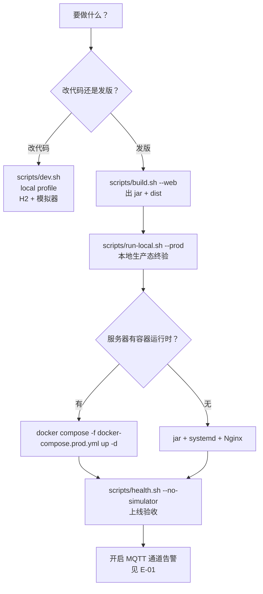
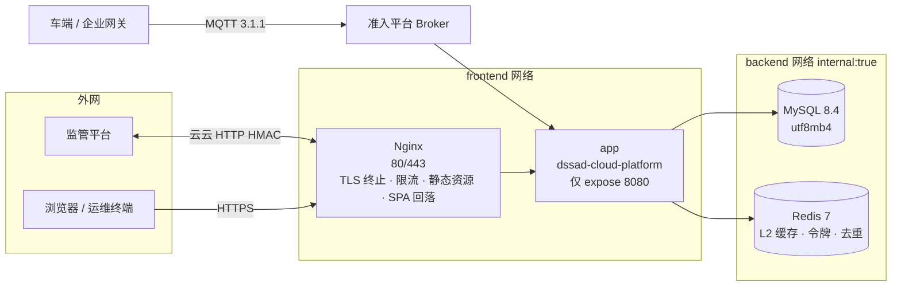

# 车路通 DSSAD 产品云平台 — 开发与部署说明

| 项目 | 内容 |
|---|---|
| 文档版本 | v1.0 |
| 编制日期 | 2026-09-23 |
| 适用版本 | `dssad-cloud-platform` 1.0.0-SNAPSHOT · 前端 `dssad-cloud-web` 1.0.0 |
| 交付形态 | 后端可执行 jar（`target/dssad-cloud-platform.jar`，69 MB）· 前端静态产物（`cloud-platform-web/dist`，2.8 MB）· 容器镜像（多阶段 Dockerfile） |
| 部署方式 | ① 容器（`docker-compose.prod.yml`）② 主机（jar + systemd + Nginx） |
| 本次验证环境 | Windows 11 23H2 · JDK 21.0.10 · MySQL 8.4.9（本机）· Redis 7（本机）· Node 22.22.2 |
| 关联文档 | 《接口文档》《数据库设计说明书》《详细设计说明书》《性能优化与压测报告》|
| 原始产物 | 本次全部实测输出留档于 `cloud-platform-server/perf/*.txt`、`.run/*.log` |

> **本文的定位**：这条流水线**跑过一遍**，所以本文以「可复现的验证」为主体。
> 每一节凡写「已验证」的结论都附实测证据（命令 + 输出摘要）；
> 未验证的部分（Docker 守护进程未启动、无 HTTPS 证书、无 Linux 主机）集中列在**附录 C**，
> 不使用「配置看起来是对的」冒充「已验证」。
>
> 同样，本次验证过程中发现的部署级风险单独列在第 14 章（编号 `E-xx`），
> 其中 `E-01` 会导致「所有探针全绿、监控面板 100% 可用，但平台收不到任何车端数据」
> —— 该问题**已在 v1.1 修复**（新增通道探针端点与脚本），完整处置与告警方案见
> 《DSSAD 云平台运维手册与告警预案》。

---

## 0 文档说明

### 0.1 本文回答什么

| 问题 | 对应章节 | 结论强度 |
|---|---|---|
| 开发机、服务器各需要装什么？怎么确认装对了？ | 第 3 章 | **实测（自检脚本实跑）** |
| 有哪些配置项？哪些必填？缺失会怎样？ | 第 4 章 | **实测（fail-fast 已验证）** |
| 怎么把项目跑起来（开发 / 本地生产态 / 服务器）？ | 第 5、6、8、9 章 | **实测（本地两条路径已实跑）** |
| 生产建表脚本能不能直接执行？ | 第 6.3 节 | **实测（MySQL 8.4.9 实执行）** |
| 生产参数能不能起服？ | 第 6.4 节 | **实测（prod profile + 真实 MySQL 已起服）** |
| 怎么确认「服务是好的」而不是「进程还在」？ | 第 10 章 | **实测（14 条断言）** |
| 上线后怎么运维？出问题怎么查？ | 第 11、13 章 | 规程 + 实测依据 |
| 有哪些部署级坑会让系统「静默失效」？ | 第 13、14 章 | 表格（每条均对应真实故障现象）|

### 0.2 本次验证覆盖了什么

| 编号 | 验证项 | 方式 | 结果 |
|---|---|---|---|
| EV-1 | 环境自检脚本 | `bash scripts/check-env.sh` | 通过，0 阻塞项 |
| EV-2 | 成品 jar + local profile 起服 | `scripts/run-local.sh --bg --port 18080` | 就绪，`Started ... in 9.337 seconds` |
| EV-3 | 全链路冒烟（14 断言） | `scripts/health.sh` | **14 通过 / 0 失败** |
| EV-4 | 优雅停止 | `scripts/run-local.sh --stop` | SIGTERM 后退出，端口释放 |
| EV-5 | 生产建表脚本在真实 MySQL 执行 | `mysql < db/schema-mysql.sql` | 13 表 / 47 索引，零报错 |
| EV-6 | prod profile + 真实 MySQL 起服（`ddl-auto=validate`）| `java -jar ... --spring.profiles.active=prod` | 就绪，`Started ... in 15.95 seconds`，L2=Redis 已装配 |
| EV-7 | prod 态冒烟（跳过模拟器） | `scripts/health.sh --no-simulator` | **10 通过 / 0 失败 / 4 跳过** |
| EV-8 | 反向探针：库表缺失时是否拒绝启动 | 空库 + prod profile | 退出码 1，`Schema-management missing table` —— **门禁真实有效** |
| EV-9 | 编排文件与 Nginx 配置静态校验 | YAML 解析 + 8 项必写项核对 | 全部通过 |
| EV-10 | 测试与覆盖率门槛 | `mvn verify` | 164 用例通过，`All coverage checks have been met` |

### 0.3 本文不回答什么

- **不覆盖容器镜像的实际构建与运行**。本机 Docker 守护进程未启动，`docker build` / `compose up` / `nginx -t` **均未真正执行过**，只做了 YAML 合法性与关键项静态核对（见附录 C）。这是本文最大的未验证面。
- **不覆盖 HTTPS 端到端**。无证书、无域名、无公网入口，TLS 终止与 301/证书链行为未验证。
- **不覆盖 systemd 单元的实际生效**。开发机为 Windows，`systemd-analyze verify` 未执行。
- **不覆盖多实例部署**。本次全部为单实例；多实例下的定时任务重复执行问题属《详细设计说明书》`P-01`（无分布式锁），**当前状态是「多实例部署前必须先修」**。

---

## 1 三条路径辨析（最容易出错的地方）

「跑起来」和「部署」是两件事，混为一谈会浪费大量时间。本项目刻意把三条路径分开，各有独立脚本与产物。

| 路径 | 目的 | profile | 产物 | 进入方式 | 本机验证 |
|---|---|---|---|---|---|
| **本地开发** | 改代码、调接口、走查 UI | `local` | 无（classes 目录）| `bash scripts/dev.sh` | 已验证 |
| **本地生产态验证** | 上服务器前终验「生产参数能否起服」 | `prod` | 可执行 jar | `bash scripts/run-local.sh --prod` | 已验证（EV-6）|
| **服务器部署** | 对外服务 | `prod`（+ 依赖由环境变量注入）| jar + systemd 或容器镜像 | 第 8、9 章 | **未验证**（无 Linux 主机）|

### 1.1 为什么必须分开

- **`local` 会掩盖生产问题**：`local` 用 H2 文件库、`ddl-auto=update`、MQTT 关闭、模拟器开启。
  这四点在 `prod` 下**全部相反**。只用 `local` 验证过的代码，在生产上会撞上「表结构不匹配」「MQTT 密码拿不到」这类只有 `prod` 才暴露的问题。
  > 本次 EV-8 就是这个价值的证明：**空库 + `prod` 会在启动阶段直接拒绝，而不是带着错表结构跑起来**。
- **`mvn spring-boot:run` 不等于「包能用」**：它跑的是 `target/classes`，跳过了打 jar 与 `spring-boot:repackage`。缺资源文件、MANIFEST 异常、Lombok 被误打进包等问题只有 `java -jar` 才会暴露。
- **容器不等于「部署」**：容器解决的是运行时一致性与编排，不解决配置正确性。本次 `E-02`（启动被监管平台阻塞）在容器里同样存在，而且会因 `start-period` 不足被判定不健康。

### 1.2 决策路径



---

## 2 部署拓扑

### 2.1 生产拓扑（容器方式）



**三个刻意的设计决定**（每一条都对应一类线上事故）：

1. **app 只 `expose` 不 `ports`** —— 唯一入口是 Nginx。
   一旦把应用端口映射到宿主机，就存在「绕过 TLS 直连后端」的路径，HTTPS 强制、入口限流、访问审计全部形同虚设。
2. **双网络隔离** —— `frontend`（Nginx ↔ app）+ `backend`（app ↔ MySQL/Redis，`internal: true`）。
   Nginx 不接 `backend`，即使 Nginx 被攻破也摸不到数据库网段；`internal: true` 同时让数据网段无法访问外网（防数据外带）。
3. **`depends_on` 用 `service_healthy`，不用 `service_started`** —— MySQL 的「进程起来了」与「能接受连接」之间差了十几秒，用 `service_started` 会让应用在数据库还没就绪时启动并失败。

### 2.2 端口与网络矩阵

| 组件 | 容器内端口 | 宿主机暴露 | 所属网络 | 说明 |
|---|---|---|---|---|
| Nginx | 80 / 443 | **是**（唯一入口）| frontend | 80 仅用于 301 跳转与 `/healthz` |
| app | 8080 | **否**（仅 expose）| frontend + backend | 由 Nginx 反代 |
| MySQL | 3306 | **否** | backend（internal）| 数据卷持久化 |
| Redis | 6379 | **否** | backend（internal）| AOF 持久化 |
| MQTT | — | — | 外部 | 准入平台提供的 Broker，非本项目部署 |

| 对外路径 | 转发目标 | 鉴权方式 |
|---|---|---|
| `/`、`/assets/**` | Nginx 静态文件 | 无（前端登录页）|
| `/api/v1/**` | app | `X-Token`（登录换取，12 小时有效）|
| `/enterprise/api/v1/**` | app | HMAC 签名（监管平台服务端调用）|
| `/manager/api/v1/**` | app | 按监管平台约定 |
| `/media/**` | Nginx 直接读盘 | URL 可猜测性（生产应加签名 URL）|
| `/api/v1/monitor/health-check` | app | 无（负载均衡/业务探活）|
| `/api/v1/monitor/mqtt-health` | app | 无（**数据通道探针**，DOWN → 503，见第 11.2 节与运维手册）|
| `/api/v1/monitor/**`（其余）| app | `X-Token`（通道指标、缓存指标、报文留痕）|
| `/actuator/health*` | app | **Nginx 精确放行 + 应用层来源 IP 白名单**（`ActuatorIpWhitelistFilter`，fail-closed，配置 `dssad.security.actuator.allowed-cidrs`）|
| `/actuator/`（其余）| — | **404**（Nginx 直接返回，不暴露指标）|

---

## 3 环境要求

### 3.1 开发机

| 项 | 要求 | 本机实测 |
|---|---|---|
| 操作系统 | Windows 10/11 · macOS · Linux 均可 | Windows 11 23H2 |
| JDK | **21**（`pom.xml` 中 `java.version=21`）| 21.0.10（`C:\Program Files\Java\jdk-21.0.10`）|
| Maven | 3.9+ | 3.9.9（`C:\Program Files\apache-maven-3.9.9`）|
| Node.js | ≥ 18（Vite 6 要求）| 22.22.2 |
| Shell | Git Bash / WSL / 原生 bash | Git Bash |
| Docker | 可选（仅容器相关流程需要）| CLI 29.4.3，**守护进程未启动** |

> ⚠️ **JDK 版本选择的坑（本机已踩）**：本机同时装有 `jdk-21.0.10` 与 `jdk-18.0.1.1`。
> 按**字母序** glob `jdk-*` 会先命中 **jdk-18**，随后 Maven 报「不支持发行版本 21」——
> 报错信息指向「代码或编译器配置」，完全指不到「选错了 JDK」这个真实原因。
> `scripts/_common.sh` 的 `find_java_home()` 按**版本号排序**（`sort -V`）取满足条件的最高版本，
> 并在构建前校验 `major ≥ 21`，从机制上消除这个坑。
>
> 另一个陷阱：**`PATH` 上的 `java` 与 Maven 实际使用的 JDK 可以不是同一个**
> （Maven 认 `JAVA_HOME`；`which java` 常命中 Oracle 的 `javapath` 转发器）。
> 脚本统一以 `JAVA_HOME` 为准，并用 `java -XshowSettings:properties -version` 反查兜底。

### 3.2 服务器（硬件建议与依据）

| 规格 | 建议 | 依据 |
|---|---|---|
| CPU | 4 核起，8 核推荐 | 应用为 IO 等待型（虚拟线程 + 连接池），CPU 不是瓶颈 |
| 内存 | 8 GB 起 | JVM 堆 2~4 GB + MySQL buffer pool 1 GB + 系统余量 |
| 磁盘 | 系统盘 50 GB + **数据盘按保留期核算** | 1000 台车 1 Hz 轨迹 ≈ 8640 万行/天 ≈ **14 GB/天**；留 30 天约 430 GB（详见《数据库设计说明书》容量估算）|
| 磁盘类型 | SSD 强烈建议 | 轨迹表为顺序写入 + 范围查询，HDD 上清理任务（`DELETE` 分批）会明显拖慢主从 |
| 网络 | 到 Broker 与监管平台的双向连通 | 平台启动即会连 Broker；云云接口由监管平台主动调用 |

### 3.3 软件版本矩阵

| 软件 | 版本 | 说明 |
|---|---|---|
| JDK | 21（LTS）| 用到虚拟线程（`spring.threads.virtual.enabled`），**不可降级到 17** |
| MySQL | **8.0.17+**（本次实测 8.4.9）| 建表脚本按 8.0.17+ 编写；`utf8mb4` 必需 |
| Redis | 6.2+（本次实测 7.x）| 仅作 L2 缓存/令牌/去重；单实例部署可 `DSSAD_REDIS_ENABLED=false` 关闭 |
| Nginx | 1.24+ | 需要 `http2 on;` 与 `limit_req` |
| MQTT Broker | 支持 MQTT 3.1.1 + **持久会话**（`clean_session=false`）| 准入平台提供；自建需开启持久化，否则「断线补发」链路不可用 |

---

## 4 配置体系

### 4.1 分层结构与正交组合

```
application.yml          所有环境共享：业务参数默认值、Jackson、日志格式、Actuator、线程模型
  ├── application-local.yml   本地：H2 文件库(ddl-auto=update) · MQTT 关闭 · 模拟器开启 · 缓存 TTL 10s
  └── application-prod.yml    生产：MySQL(ddl-auto=validate) · Redis 开 · MQTT 开 · 模拟器永久关闭
```

| profile | 生效方式 | 用途 |
|---|---|---|
| `local` | 默认（`spring.profiles.default=local`）| 克隆即跑，零外部依赖 |
| `prod` | `--spring.profiles.active=prod` | 生产参数终验与线上运行 |

> **设计取舍**：「生产必须与开发不同」的项集中在 `prod`（密钥 fail-fast、`ddl-auto=validate`、
> 日志落盘与轮转、虚拟线程、入口来源还原），与「能力开关」（数据库/缓存/MQTT）**正交组合**。
> 之所以不拆成 `prod-mysql` / `prod-h2` 这类组合 profile，是因为每多一个组合就多一份需要同步维护的
> 配置副本，而配置副本之间的漂移往往只在生产才暴露。

### 4.2 环境变量总表

**生产必填**（`application-prod.yml` 中写为 `${VAR}`；缺失时**启动即失败**，这是刻意的 fail-fast）：

| 变量 | 示例 | 用途 | 缺失后果 |
|---|---|---|---|
| `DB_HOST` | `mysql` / `10.0.0.12` | 数据库地址 | 有默认值 `127.0.0.1`。**容器里写 `localhost` 会连到容器自己**，表现为连不上库 |
| `DB_PORT` | `3306` | 数据库端口 | 默认 3306 |
| `DB_NAME` | `dssad_cloud` | 库名 | 默认 `dssad_cloud` |
| `DB_USERNAME` | `dssad` | 库账号 | **启动失败** |
| `DB_PASSWORD` | （强随机）| 库口令 | **启动失败** |
| `REDIS_HOST` / `REDIS_PORT` | `redis` / `6379` | 缓存地址 | 默认 `127.0.0.1:6379` |
| `REDIS_PASSWORD` | （强随机）| 缓存口令 | 默认空（本地 Redis 常见无口令）|
| `DSSAD_ENTERPRISE_ID` | `DSSAD-ENT-0001` | 准入平台分配的企业 ID，云云 Topic 身份标识 | **启动失败** |
| `DSSAD_MQTT_BROKER_URL` | `tcp://broker:1883` | Broker 地址 | **启动失败** |
| `DSSAD_REGULATORY_BASE_URL` | `https://reg.example.com` | 监管平台地址 | **启动失败** |
| `DSSAD_STORAGE_PUBLIC_URL` | `https://dssad.example.com/media` | 媒体公网基址（下发给前端/监管方）| **启动失败** |
| `DSSAD_SRS_URL` | `https://dssad.example.com` | SRS 流媒体地址 | **启动失败** |
| `DSSAD_ADMIN_PASSWORD` | （强随机）| 管理端登录口令 | **静默回落到开发默认口令 `dssad@2026`**（不会报错，最危险）|

**生产可选**（有默认值，按需覆盖）：

| 变量 | 默认 | 说明 |
|---|---|---|
| `DSSAD_ENTERPRISE_NAME` | 车路通DSSAD云平台 | 上报给监管平台的企业名 |
| `DSSAD_MQTT_USERNAME` | 取 `DSSAD_ENTERPRISE_ID` | Broker 账号 |
| `DSSAD_MQTT_PASSWORD` | 空 | **留空会在启动时调监管平台换密**（见 `E-02`）|
| `DSSAD_MQTT_SUBSCRIBE_CAR` | `false` | 通道 A（车端直连监管平台）保持 false；通道 B（企业自建网关）设 true |
| `DSSAD_STORAGE_TYPE` | `local` | 媒体存储类型 |
| `DSSAD_STORAGE_ROOT` | `/data/dssad/media` | 媒体落盘目录 |
| `DSSAD_LOG_DIR` | `/var/log/dssad` | 日志目录（该目录必须可写）|
| `DSSAD_AUDIT_MODE` | `sampled` | 报文留痕档位：`full` / `sampled` / `event-only` |
| `DSSAD_AUDIT_SAMPLE_RATE` | `0.05` | 采样率（`sampled` 时生效）|
| `DSSAD_AUDIT_RETENTION_DAYS` | `180` | 留痕保留天数 |
| `DSSAD_TRACK_RETENTION_DAYS` | `90` | 轨迹点保留天数（**按磁盘容量核算，不要拍脑袋**；`0` = 不清理）|
| `DSSAD_STATE_RETENTION_DAYS` | `180` | 状态流水保留天数 |
| `DSSAD_RETENTION_BATCH_SIZE` | `5000` | 单批删除行数（调大加快清理但延长持锁时间）|
| `JAVA_OPTS` | 见模板 | JVM 参数 |

生成强随机口令：

```bash
bash scripts/check-env.sh --gen-secret 24
```

### 4.3 业务配置项参考（`dssad.*`）

| 配置项 | 默认 | 说明 |
|---|---|---|
| `dssad.enterprise-id` | `DSSAD-ENT-0001` | 企业身份标识 |
| `dssad.mqtt.enabled` | `false`（local）/ `true`（prod）| MQTT 总开关 |
| `dssad.mqtt.clean-session` | `false` | **文档 5.1.1/6.1.1 明确要求持久会话**，不要改为 true |
| `dssad.mqtt.consumer-threads` | `4` | 入站消费线程数 |
| `dssad.mqtt.virtual-threads` | `true` | 消费线程用虚拟线程承载（Java 21）|
| `dssad.mqtt.offline-cache-size` | `10000` | 离线缓存条数上限 |
| `dssad.mqtt.retry.confirm-interval-millis` / `confirm-max-attempts` | `5000` / `3` | 对端未确认（`res != 1`）时的重试节奏（文档 5.1.4.1）|
| `dssad.mqtt.retry.invalid-interval-millis` / `invalid-max-attempts` | `3000` / `5` | 对端回复异常（`res = 2/3`）时的重试节奏（文档 8.1）|
| `dssad.redis.enabled` | `false`（local）/ `true`（prod）| 二级缓存 L2 开关 |
| `dssad.cache.l1-max-size` | `10000`（local）/ `50000`（prod）| Caffeine 容量 |
| `dssad.cache.l1-default-ttl-seconds` | `10`（local）/ `30`（prod）| L1 TTL |
| `dssad.cache.l2-default-ttl-seconds` | `10`（local）/ `60`（prod）| L2 TTL（多实例跨实例一致性靠它）|
| `dssad.rate-limit.enabled` / `http-per-minute` / `mqtt-per-second` | `true` / `100` / `10` | 限流参数。⚠️ **当前实现未接入请求链路，配置不生效**（`F-01`，见《性能优化与压测报告》）|
| `dssad.audit.mode` / `sample-rate` / `retention-days` | `sampled` / `0.05` / `180` | 报文留痕策略 |
| `dssad.retention.track-point-days` | `90` | 轨迹保留天数（每天 03:30 清理）|
| `dssad.retention.state-snapshot-days` | `180` | 状态流水保留天数 |
| `dssad.retention.batch-size` | `5000` | 每批删除行数 |
| `dssad.api.max-page-size` | `200` | 分页上限（防大页拖垮数据库）|
| `dssad.api.track-simplify-tolerance` | `8.0` | 轨迹抽稀容差（米）|
| `dssad.api.history-video-max-span-hours` | `168` | 历史视频单次查询最大跨度（小时）|
| `dssad.simulator.enabled` | `true`（local）/ **`false`（prod，永久）** | 报文注入模拟器。⚠️ 开启会凭空写入事故/故障，**污染监管取证链路** |
| `dssad.storage.max-upload-bytes` | `209715200` | 单文件上限 200 MB（文档 9.2）|

### 4.4 密钥管理原则

1. **仓库内不存任何口令**。`application-prod.yml` 中所有密钥类配置一律写成 `${VAR}` 且**不给默认值**，
   靠环境变量注入；缺失时启动直接失败，而不是用空口令连库。
2. **`.gitignore` 已排除** `.env`、`deploy/systemd/*.env`、`*.p12|*.jks|*.pem|*.key|*.jwt_secret`。
3. **`.dockerignore` 同步排除** —— 镜像层是永久留存的，密钥一旦进过某一层，删掉文件也能被挖出来。
4. 服务器侧 `EnvironmentFile` 权限设 `600`，属主为运行账号。
5. 唯一有「静默回落」风险的项是 `DSSAD_ADMIN_PASSWORD`（不设就用开发默认口令），
   上线验收清单把它列为必查项。

---

## 5 本地开发

### 5.1 三步上手（已验证）

```bash
bash scripts/check-env.sh     # 1. 自检：先确认环境，否则环境问题会伪装成代码问题
bash scripts/dev.sh           # 2. 起后端(8080) + 前端(5173)
bash scripts/health.sh        # 3. 全链路冒烟，14 条断言
```

登录：<http://127.0.0.1:5173> → `admin` / `dssad@2026`（local profile 未设环境变量时的开发默认值）。

**自检实测输出**（`check-env.sh`，本机）：

```
== 1/6 基础工具 ==
  ✓ JDK 21+ 可用：/c/Program Files/Java/jdk-21.0.10（major=21）
  ✓ Maven 可用：C:\Program Files\apache-maven-3.9.9/bin/mvn.cmd
  ✓ Node.js v22.22.2 / npm 10.9.7（Vite 6 要求 Node ≥ 18）
[警告] Docker CLI 已装但守护进程未启动 —— 容器相关命令（build/up）不可用，其余流程不受影响
== 3/6 端口占用 ==
  ✓ 端口 8080 空闲   ✓ 端口 5173 空闲
[警告] 端口 3306 已被占用   [警告] 端口 6379 已被占用   ✓ 端口 1883 空闲
== 6/6 版本信息汇总 ==
[通过] 环境自检通过，无阻塞项
```

> 自检对 Docker 守护进程未启动只给**警告不给阻塞**：容器只是两条部署路径之一，
> 主机的 jar + systemd 路径完全不受影响。把可选依赖标成阻塞项，会让人误以为「环境没配好」。

### 5.2 脚本行为说明

| 脚本 | 行为要点 |
|---|---|
| `dev.sh` | 后端走 `mvn spring-boot:run`（改代码可热重启）；前端走 `npm run dev`（首次自动 `npm ci`）；两者都**轮询就绪后才返回**；`--logs` 跟随日志，`--stop` 停止 |
| `run-local.sh` | 用**成品 jar** 起服；`--bg` 后台 + 就绪轮询；`--stop` 优雅停止（SIGTERM → 等 15s → SIGKILL）；`--prod` 走生产 profile；`--port` 换端口 |
| `build.sh` | 默认 `mvn verify`（含测试 + **覆盖率门槛**）；`--web` 追加前端 type-check + build；`--docker` 构建镜像 |
| `health.sh` | 14 条断言（见第 10 章）；`--no-simulator` 用于生产态实例 |

### 5.3 常见开发任务

**切到本机 MySQL 联调**（本机 3306 已有一个 MySQL 8.4.9）：

```bash
# 建库并灌入生产 DDL（脚本无 USE/CREATE DATABASE，必须先选库）
mysql -h 127.0.0.1 -u root -p -e "CREATE DATABASE dssad_cloud CHARACTER SET utf8mb4 COLLATE utf8mb4_unicode_ci;"
mysql -h 127.0.0.1 -u root -p dssad_cloud < cloud-platform-server/db/schema-mysql.sql

# 用 prod profile 起服（会触发 ddl-auto=validate，正是我们想验的）
export DB_HOST=127.0.0.1 DB_PORT=3306 DB_NAME=dssad_cloud DB_USERNAME=root DB_PASSWORD=你的口令
export REDIS_HOST=127.0.0.1 REDIS_PORT=6379
export DSSAD_ENTERPRISE_ID=DSSAD-ENT-0001
export DSSAD_MQTT_BROKER_URL=tcp://127.0.0.1:1883
export DSSAD_REGULATORY_BASE_URL=https://reg-platform.example.com
export DSSAD_STORAGE_PUBLIC_URL=http://127.0.0.1:8080/media
export DSSAD_SRS_URL=http://127.0.0.1:8080
export DSSAD_ADMIN_PASSWORD=dev-only
bash scripts/run-local.sh --prod --bg
```

**连真实 MQTT Broker**：把 `dssad.mqtt.enabled=true` 与 `dssad.mqtt.broker-url` 覆盖即可
（local profile 默认关闭，避免开发机必须装 Broker）。

**看 H2 里的数据**：<http://127.0.0.1:8080/h2-console>（仅 `local` 开启）。
JDBC URL 填 `jdbc:h2:file:./data/db/dssad;MODE=MySQL;DB_CLOSE_DELAY=-1;AUTO_SERVER=TRUE`，用户 `sa`，口令空。

**只用外部依赖、应用仍在 IDE 里跑**：

```bash
docker compose up -d                 # MySQL + Redis
docker compose --profile mqtt up -d  # 需要 Broker 时
```

### 5.4 本地数据与清理

| 路径 | 内容 | 清理方式 |
|---|---|---|
| `cloud-platform-server/data/db/` | H2 文件库（local profile）| 停服后删除该目录（已在 `.gitignore`）|
| `cloud-platform-server/data/media/` | 本地媒体文件 | 同上 |
| `.run/` | 脚本启动的 pid 与日志 | 脚本自行维护；可直接删除 |
| `target/site/jacoco/` | 覆盖率报告 | `mvn clean` |

---

## 6 本地生产态验证（不要跳过）

### 6.1 为什么不能跳过

`prod` profile 打开了三件 `local` 下永远不会触发的事：

1. **`ddl-auto=validate`** —— 实体与真实表结构必须完全一致，否则拒绝启动。这是投产时最常见的启动失败原因，也是本次验证的重点。
2. **密钥 fail-fast** —— 必填环境变量缺失直接失败，而不是用默认值跑起来。
3. **L2 缓存接入 Redis + 虚拟线程 + 日志落盘轮转** —— 都只在 `prod` 生效。

### 6.2 用成品 jar 起服（已验证，EV-2 / EV-4）

```bash
bash scripts/build.sh                      # or --web 连前端一起
bash scripts/run-local.sh --bg --port 18080
bash scripts/health.sh --base-url http://127.0.0.1:18080
bash scripts/run-local.sh --stop
```

实测输出摘要：

```
[通过] 服务已就绪：http://127.0.0.1:18080
日志：Started DssadCloudApplication in 9.337 seconds
      Tomcat started on port 18080 (http) with context path '/'
（冒烟）通过 14 项，失败 0 项，跳过 0 项 → 全链路冒烟通过
（停止）[信息] 向进程 241 发送 SIGTERM（应用配置了优雅停机...）→ [通过] 已停止
      停止后探测 HTTP=000（端口已释放）
```

### 6.3 生产建表脚本在真实 MySQL 上执行（已验证，EV-5）

```bash
mysql -h 127.0.0.1 -u root -e "CREATE DATABASE dssad_cloud_verify CHARACTER SET utf8mb4 COLLATE utf8mb4_unicode_ci;"
mysql -h 127.0.0.1 -u root dssad_cloud_verify < cloud-platform-server/db/schema-mysql.sql
```

> **注意**：`db/schema-mysql.sql` **不含** `USE` 与 `CREATE DATABASE`，
> 因此执行时必须显式指定库名（或不带库名执行会因「没有选中数据库」失败）。

实测结果（MySQL 8.4.9）：

| 指标 | 实测值 | 与《数据库设计说明书》是否一致 |
|---|---|---|
| 表数量 | **13** | 一致 |
| 索引数量 | **47** | 一致 |
| 报错 | 0 | — |
| 表清单 | `t_accident_event` `t_fault_item` `t_fault_record` `t_map_barrier` `t_media_asset` `t_mqtt_message_log` `t_navigation_route` `t_remote_driving_record` `t_track_task` `t_vehicle` `t_vehicle_state_snapshot` `t_vehicle_static_param` `t_vehicle_track_point` | 一致 |

### 6.4 prod profile + 真实 MySQL 起服（已验证，EV-6 / EV-7）

```bash
export DB_HOST=127.0.0.1 DB_PORT=3306 DB_NAME=dssad_cloud_verify DB_USERNAME=root DB_PASSWORD=
export REDIS_HOST=127.0.0.1 REDIS_PORT=6379
export DSSAD_ENTERPRISE_ID=DSSAD-VERIFY-0001 DSSAD_MQTT_BROKER_URL=tcp://127.0.0.1:1883
export DSSAD_REGULATORY_BASE_URL=http://127.0.0.1:9/regulatory
export DSSAD_STORAGE_PUBLIC_URL=http://127.0.0.1:18090/media DSSAD_SRS_URL=http://127.0.0.1:18090
export DSSAD_ADMIN_PASSWORD=verify-only-pass DSSAD_LOG_DIR=./.run/prod-logs
java -jar cloud-platform-server/target/dssad-cloud-platform.jar \
     --spring.profiles.active=prod --server.port=18090
```

实测结果：

| 检查点 | 结果 | 说明 |
|---|---|---|
| `Started ... in 15.95 seconds` | 通过 | 生产参数可起服 |
| `ddl-auto=validate` | **通过** | 13 张表与 JPA 实体完全一致 —— 这是生产 DDL 与实体一致性的**强证明** |
| L2 缓存 | `L1=Caffeine(maxSize=50000)，L2=Redis` | Redis 已接管跨实例一致性 |
| 入站消费线程 | `已启动 4 个报文消费线程（虚拟线程）` | 虚拟线程生效 |
| MQTT Broker 不可达 | **仍成功启动**，退避重连（最多 60s）| 依赖不可用不阻断启动（合理降级）|
| 冒烟（`--no-simulator`）| **10 通过 / 0 失败 / 4 跳过** | 生产态可用 |
| `ERROR` 日志 | 2 行（均为 MQTT 不可达）| 见 `E-01` |

### 6.5 反向探针：证明门禁真的在拦（已验证，EV-8）

只验证「正确配置能起服」是不够的 —— 那只证明「没报错」，不证明「该报错时会报错」。
所以做一组反向探针：**给一个空的库**，看它是否会拒绝启动。

```bash
mysql -h 127.0.0.1 -u root -e "CREATE DATABASE dssad_empty_probe CHARACTER SET utf8mb4;"
DB_NAME=dssad_empty_probe java -jar ... --spring.profiles.active=prod   # 其余变量同上
```

实测结果：

```
进程退出码=1
Failed to initialize JPA EntityManagerFactory: [PersistenceUnit: default] Unable to build Hibernate SessionFactory;
nested exception is org.hibernate.tool.schema.spi.SchemaManagementException:
  Schema-validation: missing table [t_accident_event]
（Tomcat / Started 日志行数：0 —— 从未启动到能对外服务）
```

**结论**：`ddl-auto=validate` 是**真实生效的门禁**，不是被静默关掉的配置。
这条探针的价值在于：它把「schema 与实体漂移」这类问题**锁死在启动阶段**，
而不是让它拖到运行期以「查不到数据 / 写不进去」的形式出现 —— 后者排查成本高一个数量级。

---

## 7 构建

### 7.1 后端

```bash
bash scripts/build.sh            # mvn verify（含测试 + 覆盖率门槛）
bash scripts/build.sh --clean    # 先 mvn clean
bash scripts/build.sh --skip-tests   # 仅本地试跑，产物不可发布
bash scripts/build.sh --docker   # 追加构建容器镜像
```

- 产物：`cloud-platform-server/target/dssad-cloud-platform.jar`（69 MB，`spring-boot:repackage` 可执行 jar）
- 报告：`cloud-platform-server/target/site/jacoco/index.html`
- 构建前脚本会校验 `JAVA_HOME` 存在且 **major ≥ 21**，避免「选错 JDK」

### 7.2 前端

```bash
bash scripts/build.sh --web
# 等价于
cd cloud-platform-web && npm run type-check && npm run build
```

- 产物：`cloud-platform-web/dist`（2.8 MB）
- `npm run type-check` 走 `vue-tsc --noEmit`，**零错误才继续构建**
- 构建产物按 `manualChunks` 拆成 `vue` / `element` / `echarts` 三包，
  避免「一个 3 MB 的 vendor chunk 阻塞首屏」；`chunkSizeWarningLimit: 1200`
- `sourcemap: false`：生产不暴露源码映射（需要线上排障时临时打开）

> **前端不需要任何 CORS 配置**：开发期由 Vite `server.proxy` 把 `/api`、`/enterprise`、
> `/manager`、`/media` 转发到后端，生产由 Nginx 同源反代。
> 这样「开发能跑、上线跨域」这类只在部署时才暴露的问题被结构性消除。

### 7.3 覆盖率门槛（本次已修复接线）

`pom.xml` 中声明了 `jacoco.line.coverage.min=0.60`，但**原版本只有 `prepare-agent` 与 `report` 两个执行，
没有 `check`** —— 也就是说这个门槛是**死配置**：覆盖率即便降到 10%，构建照样成功。
这与《性能优化与压测报告》中的 `F-01`（限流器未接入）属于**同一族问题**：配置/代码存在，但从未被调用。

本次已接线：

```xml
<execution>
  <id>check-coverage</id>
  <phase>verify</phase>
  <goals><goal>check</goal></goals>
  <configuration>
    <rules><rule><element>BUNDLE</element><limits><limit>
      <counter>LINE</counter><value>COVEREDRATIO</value>
      <minimum>${jacoco.line.coverage.min}</minimum>
    </limit></limits></rule></rules>
  </configuration>
</execution>
```

设计为绑定 `verify` 阶段：

| 命令 | 出报告 | 校验门槛 | 用途 |
|---|---|---|---|
| `mvn test` / `mvn package` | 是 | 否 | 本地快速迭代 |
| `mvn verify` | 是 | **是** | CI 与发布（`build.sh` 默认走这条）|

实测（`mvn verify`）：

```
Tests run: 200, Failures: 0, Errors: 0, Skipped: 1
jacoco:0.8.12:check (check-coverage) → Analyzed bundle 'dssad-cloud-platform' with 167 classes
All coverage checks have been met.
BUILD SUCCESS (33.308 s)
```

当前实际覆盖率（JaCoCo，167 类）：

| 维度 | 覆盖率 | 分子/分母 |
|---|---|---|
| 行 | **73.39%** | 2383 / 3247 |
| 指令 | 74.99% | 12853 / 17140 |
| 方法 | 80.06% | 546 / 682 |
| 分支 | **52.30%** | 579 / 1107 |

> 门槛设为 0.60 而当前为 0.73 —— 留出约 13 个百分点的缓冲，
> 是为了让「新增一个纯 DTO / 未覆盖分支」不至于直接打断构建，
> 同时又能拦住「整体覆盖断崖式下滑」。**分支覆盖 52.30% 仍是下一阶段该提升的项**
> （失败分支与边界条件集中在这里，详见《测试说明》）。
> 本次新增的 Actuator 访问控制测试把分支覆盖从 50.55% 拉到 **52.30%** ——
> 这也是它顺带的价值：白名单逻辑几乎全是「该拒的有没有拒」，行覆盖对这类语义不敏感。

### 7.4 版本与产物命名

- 版本号在 `cloud-platform-server/pom.xml` 的 `<version>`（当前 `1.0.0-SNAPSHOT`）
- `<finalName>dssad-cloud-platform</finalName>`：产物名**不带版本号**，
  这样 systemd/容器/脚本里的路径不需要随版本变化，发版只换文件不改配置
- 容器镜像用 `${APP_TAG}` 打标（默认 `latest`）；**发布必须显式指定**，例：`APP_TAG=1.0.0`

---

## 8 部署方式一：容器

### 8.1 Dockerfile 要点（逐条对应一类真实故障）

| 做法 | 不这么做会怎样 |
|---|---|
| 多阶段构建：先只 `COPY pom.xml` 跑 `dependency:go-offline`，再 `COPY src` | 改一行业务代码就重新下载全部依赖，构建从秒级变分钟级 |
| 运行镜像用 **alpine** | Temurin 的 ubuntu 基础镜像**不含 curl/wget**，`HEALTHCHECK` 会静默失效（容器永远 healthy 或永远 unhealthy，且不报错）|
| `apk add tzdata` + `ENV TZ=Asia/Shanghai` | 镜像默认 UTC，日志与「按天统计」整体错位 8 小时 |
| 建 `dssad` 用户并 `USER dssad` | 应用被攻破即拿到容器内 root |
| `HEALTHCHECK` 打 **liveness** 而非整体 health | 整体 health 会算上 MySQL/Redis/MQTT，依赖抖动引发容器被反复重启 |
| `ENTRYPOINT ["sh","-c","exec java ..."]` | 少了 `exec`，`sh` 是 PID 1 且收不到 SIGTERM，**优雅停机永不执行**，只能等超时被 SIGKILL（表现为「每次重启丢几条在途报文」）|
| 构建阶段 `-DskipTests` | 测试是 CI 门禁，与镜像构建耦合会让「只改配置的发版」被一个随机失败用例卡住。**CI 应先跑 `mvn verify` 再 `docker build`** |

> `HEALTHCHECK` 依赖的 `/actuator/health/liveness` **只在 K8s 环境默认开启**，
> 非 K8s（Compose / systemd）下会 404。本项目已在 `application.yml` 显式打开
> `management.endpoint.health.probes.enabled=true`，否则健康检查形同虚设。

### 8.2 生产编排要点

| 设计 | 理由 |
|---|---|
| `app` 只 `expose: 8080`，无 `ports` | 唯一入口是 Nginx，杜绝绕过 TLS 直连后端 |
| `frontend` + `backend(internal: true)` 双网络 | Nginx 不接数据网段；数据网段无法访问外网（防数据外带）|
| `depends_on: condition: service_healthy` | MySQL「进程起来」≠「能接受连接」|
| `${VAR:?}` 必填变量 | 缺失时 compose 直接报错退出，而不是起一个「连不上库、静默降级」的容器 |
| 各服务带 `healthcheck` + `TZ` | 编排可判断可用性；时区一致 |
| `mysql` 挂载 `db/schema-mysql.sql` 到 `docker-entrypoint-initdb.d` | 首次启动自动建表（**仅在数据卷为空时执行**）|
| `redis-server --requirepass ... --appendonly yes --maxmemory-policy allkeys-lru` | 口令 + 持久化 + 缓存逐出策略（**不设 maxmemory 会被 OOM Killer 杀掉**）|
| 证书目录 `./deploy/nginx/certs` | Nginx 启动即读证书，目录为空会**直接退出**，而 compose 已拉起应用 → 「进程都在跑但网站打不开」|

### 8.3 首次上线步骤

```bash
# 1) 准备配置
cp deploy/systemd/dssad-cloud-platform.env.example .env
bash scripts/check-env.sh --gen-secret 24      # 生成强随机口令，填进 .env
vim .env                                       # 逐项填全，特别是 DSSAD_ADMIN_PASSWORD
chmod 600 .env

# 2) 准备 TLS 证书（放到 deploy/nginx/certs/server.crt | server.key）
#    联调可用自签证书，见 9.4

# 3) 构建前端产物并同步到服务器（dist 由 Nginx 挂载）
bash scripts/build.sh --web

# 4) 起服
docker compose -f docker-compose.prod.yml up -d --build
docker compose -f docker-compose.prod.yml ps

# 5) 上线验收
bash scripts/health.sh --base-url https://your-domain --no-simulator
```

### 8.4 生产必查的三件事

```bash
# ① 容器健康状态（注意看 health 列，不看 State）
docker compose -f docker-compose.prod.yml ps
# ② 应用日志（重点看是否有 ERROR）
docker compose -f docker-compose.prod.yml logs --tail=100 app
# ③ 确认 MQTT 通道真的连上了 —— 探活全绿不代表能收到数据（E-01）
curl -s -H "X-Token: $TOKEN" https://your-domain/api/v1/monitor/mqtt | grep -o '"connected":[a-z]*'
```

---

## 9 部署方式二：jar + systemd + Nginx

适用于没有容器运行时的服务器（或有意避免容器复杂度）。

### 9.1 初始化步骤

```bash
# 1) 专用低权账号
sudo useradd --system --no-create-home --shell /usr/sbin/nologin dssad

# 2) 目录
sudo mkdir -p /opt/dssad /etc/dssad /var/log/dssad /data/dssad/media
sudo chown -R dssad:dssad /opt/dssad /var/log/dssad /data/dssad

# 3) 上传 jar（在构建机上 scp）
scp cloud-platform-server/target/dssad-cloud-platform.jar server:/tmp/
sudo mv /tmp/dssad-cloud-platform.jar /opt/dssad/

# 4) 环境变量文件（含口令，权限 600）
sudo cp deploy/systemd/dssad-cloud-platform.env.example /etc/dssad/dssad-cloud-platform.env
sudo vim /etc/dssad/dssad-cloud-platform.env
sudo chmod 600 /etc/dssad/dssad-cloud-platform.env

# 5) 建库灌表
mysql -h $DB_HOST -u $DB_USERNAME -p -e "CREATE DATABASE dssad_cloud CHARACTER SET utf8mb4 COLLATE utf8mb4_unicode_ci;"
mysql -h $DB_HOST -u $DB_USERNAME -p dssad_cloud < cloud-platform-server/db/schema-mysql.sql

# 6) systemd
sudo cp deploy/systemd/dssad-cloud-platform.service /etc/systemd/system/
sudo systemctl daemon-reload
sudo systemctl enable --now dssad-cloud-platform
systemctl status dssad-cloud-platform
journalctl -u dssad-cloud-platform -f

# 7) Nginx + 前端产物
bash scripts/build.sh --web
sudo rsync -a --delete cloud-platform-web/dist/ /usr/share/nginx/html/
sudo mkdir -p /var/www/media
sudo cp deploy/nginx/dssad-cloud.conf /etc/nginx/conf.d/
sudo sed -i 's/^    server app:8080/    server 127.0.0.1:8080/' /etc/nginx/conf.d/dssad-cloud.conf
sudo nginx -t && sudo nginx -s reload
```

> ⚠️ **上传前确认脚本是 LF 换行**。仓库已用 `.gitattributes` 锁定（`*.sh text eol=lf`、`*.service text eol=lf`）。
> 若从 Windows 直接拷文件过去，CRLF 会让 systemd 报
> `Failed to parse ... Invalid argument`、让 shell 报 `/bin/bash^M: bad interpreter` ——
> 两者都**不指向换行符**这个真实原因。

### 9.2 systemd 单元要点

| 指令 | 理由 |
|---|---|
| `User=dssad` + 专用账号 | 最小权限，不与应用共用登录账号 |
| `EnvironmentFile=/etc/dssad/dssad-cloud-platform.env` | 密钥不进命令行（`ps` 可见）也不进单元文件（可被任意用户读）|
| `KillSignal=SIGTERM` + `TimeoutStopSec=60` | 让 Spring 的 shutdown hook 跑完（关 MQTT、提交在途批量写、释放连接池）。**超时必须大于应用侧优雅停机超时**，否则又变成 SIGKILL |
| `Restart=on-failure` + `StartLimitIntervalSec=300` / `StartLimitBurst=5` | 配置写错时不进入无限重启风暴，5 分钟内失败 5 次即停下等人处理 |
| `NoNewPrivileges` / `ProtectSystem=full` / `ProtectHome` | 系统目录只读、家目录不可见 |
| `ReadWritePaths=/var/log/dssad /data/dssad` | `ProtectSystem=full` 会让 `/usr`、`/boot`、`/etc` 只读，**应用需要写的目录必须显式开放**，否则表现为「启动时莫名其妙无权限」 |
| `MemoryMax=6G` + `LimitNOFILE=65535` | 内存上限防拖垮宿主；连接/文件句柄上限要大于连接池 + 线程数 |

### 9.3 Nginx 必写项（漏了会出事）

| 配置 | 不写的后果 |
|---|---|
| `proxy_set_header X-Forwarded-Proto $scheme;` | 应用侧 `forward-headers-strategy=framework` 会把所有请求判为非安全通道；未来开启 `require-https` 后会与入口的 301 形成**无限重定向循环** |
| `client_max_body_size 210m;` | 200 MB 事故视频上传被 413 拒绝（文档 9.2 约定单文件 ≤ 200 MB）|
| `proxy_read_timeout 120s;` | 长事务请求超时 |
| `location /actuator/ { return 404; }` | `/actuator/metrics`、`/actuator/prometheus` 会暴露 JVM 堆、连接池等待数、接口耗时分布 —— 等于一份系统说明书。**用 404 而非 403**，让外部无法枚举端点是否存在。⚠️ 这只是**第一道**：应用层还有 `ActuatorIpWhitelistFilter` 的**来源 IP 白名单（fail-closed）**，二者叠加才能挡住「绕过 Nginx 的容器内/同宿主机直连」 |
| 登录接口单独 `limit_req zone=login_zone` | 可被撞库。⚠️ 应用层限流当前未生效（`F-01`），**入口层限流是目前唯一真实生效的一道** |
| `try_files $uri $uri/ /index.html;`（SPA 兜底）| 前端 history 路由（`/monitor`、`/events`）直接刷新会 404 |
| `location = /index.html` 不缓存 + `/assets/` 长缓存 | 不加会导致发版后用户拿到旧壳；加错会导致用户拿到旧 JS |
| `gzip off;` | 应用已开 `server.compression`，Nginx 再压是重复劳动 |
| TLS `ssl_protocols TLSv1.2 TLSv1.3` + `ssl_ciphers` | 弱套件可被协商上 |
| `ssl_certificate` 指向的文件**必须先存在** | 目录为空时 Nginx 直接退出，而编排已把应用拉起 → 「进程都在跑但网站打不开」 |
| `/media/` 由 Nginx 直接读盘（`alias` + `autoindex off`）| 事故视频是 GB 级流量，经应用转发会白占 Tomcat 线程与连接 |

### 9.4 TLS 与证书

```bash
# 联调用自签证书（必须显式声明 SAN，否则浏览器/客户端按 IP 访问会校验失败）
sudo mkdir -p deploy/nginx/certs
openssl req -x509 -nodes -days 365 -newkey rsa:2048 \
  -keyout deploy/nginx/certs/server.key \
  -out    deploy/nginx/certs/server.crt \
  -subj "/C=CN/ST=Sichuan/L=Chengdu/O=Genvict/CN=dssad.example.com" \
  -addext "subjectAltName=DNS:dssad.example.com,DNS:localhost,IP:127.0.0.1"
sudo chmod 600 deploy/nginx/certs/server.key
```

生产务必使用受信 CA 签发的证书（内网可自建 CA 并下发根证书到客户端）。
证书续期后 `nginx -s reload` 即可，无需重启应用。

---

## 10 上线验收清单

**每项都给出验证方法**，不写「配置正确」这类不可执行的项。

| # | 验收项 | 验证方法 | 通过标准 | 本次是否已验证 |
|---|---|---|---|---|
| 1 | 环境无阻塞项 | `bash scripts/check-env.sh` | 退出码 0 | ✅ EV-1 |
| 2 | 库表与实体一致 | 空库起服应**失败**；正确库起服应成功 | 空库退出码 1 且报 `missing table` | ✅ EV-5/6/8 |
| 3 | 生产参数可起服 | `java -jar ... --spring.profiles.active=prod` | 日志出现 `Started ... in N seconds` | ✅ EV-6 |
| 4 | 鉴权不可绕过 | `bash scripts/health.sh --no-simulator` 第 2 条 | 无令牌访问返 `2001` | ✅ EV-7 |
| 5 | 令牌可主动吊销 | 同上第 14 条 | 登出后旧令牌返 `2001` | ✅ EV-7 |
| 6 | 业务写后即可读 | 本地用模拟器注入事故后查详情 | 返 `0000` 且归属车辆正确 | ✅ EV-3（local）|
| 7 | 缓存层就绪 | 启动日志 + `/api/v1/monitor/cache` | `L2=Redis` 且接口返 `0000` | ✅ EV-6/7 |
| 8 | 虚拟线程生效 | 启动日志 | `已启动 4 个报文消费线程（虚拟线程）` | ✅ EV-6 |
| 9 | **MQTT 通道已连接** | `curl -s -o /dev/null -w '%{http_code}' 本机:8080/api/v1/monitor/mqtt-health` | **200**（503 = 通道断） | ✅ 端点已就绪（v1.1）；线上需逐台核实 |
| 10 | MQTT 通道有告警 | 挂好 `scripts/mqtt-watch.sh` 且已触发过一次 | 可收到告警 | ⚠️ **工具已就绪，需运维挂到监控平台**（`E-01` → 运维手册 4.4）|
| 11 | 管理端口令已覆盖 | 登录响应中 `usingDefaultCredential` | `false` | ⚠️ 代码有该字段，本次未做生产级核对 |
| 12 | HTTPS 生效 | `curl -sI https://域名` | 200，且 `http://` 跳 `https://` | ❌ 未验证（附录 C）|
| 13 | `/actuator` 已**双层收敛** | ① `curl https://域名/actuator/metrics` → 404（Nginx）；② 从**非白名单 IP** 直连 8080 打 `/actuator/health` → 404（应用层白名单）；③ 从白名单 IP → 200 | ❌ Nginx 侧未验证（需真实环境）；应用层白名单已有 28 个单测覆盖 |
| 14 | 数据保留期已核算 | 核对 `.env` 中 `DSSAD_TRACK_RETENTION_DAYS` ≠ 0 | 与磁盘容量匹配 | ⚠️ 配置项存在，取值需按现场定 |
| 15 | 模拟器已关闭 | `/api/v1/simulator/**` 应不可用 | 注入失败 | ✅ prod 启动日志确认（未显式验证接口）|
| 16 | 日志目录可写且轮转配置生效 | 启动后 `ls -la /var/log/dssad` | 有 `dssad-cloud-platform.log` | ⚠️ 本地已用 `DSSAD_LOG_DIR` 验证可写 |
| 17 | 覆盖率门槛已接线 | `mvn verify` | `All coverage checks have been met` | ✅ EV-10 |

**未通过项 = 阻塞上线**。第 9/10 项是本清单里最容易被漏掉、后果最严重的一条。

---

## 11 运维手册

### 11.1 日志

| 位置 | 内容 |
|---|---|
| `/var/log/dssad/dssad-cloud-platform.log` | 应用主日志；单文件 200 MB 轮转，保留 30 份，总上限 10 GB |
| `/var/log/dssad/stdout.log` / `stderr.log` | systemd 捕获的标准输出 |
| `docker compose logs app` | 容器方式 |
| `/var/log/nginx/dssad-access.log` / `dssad-error.log` | 入口访问与错误 |

日志格式（单行结构化，便于 Filebeat/Loki 采集）：

```
%d{yyyy-MM-dd HH:mm:ss.SSS} %-5level [%thread] %logger{36} - %msg%n
```

- 生产 `root: WARN`、`com.genvict.dssad.cloud: INFO` —— 业务日志完整，框架噪音压掉
- Paho 默认压到 `WARN`（它断线重连时会刷大量 DEBUG）
- 常见排查入口：`grep -E "ERROR|WARN" 日志 | tail -50`

### 11.2 监控指标与告警

**必须采集的指标**（`/api/v1/monitor/mqtt` 全部为已实现字段）：

| 指标字段 | 含义 | 告警建议 |
|---|---|---|
| `connected` | MQTT 是否已连接 | **`false` 持续 > 2 分钟即告警**（★ 最重要，见 `E-01`）|
| `reconnectAttempts` | 累计重连次数 | 持续增长即告警（退避最长 60 s）|
| `state` | 通道状态 | 非 `CONNECTED` 告警 |
| `inboundDropped` | 入站队列丢弃报文数 | **> 0 即告警**（说明消费跟不上，正在丢数据）|
| `offlineDroppedByPressure` / `offlineDroppedLowPriority` | 离线队列按压力/低优先级丢弃数 | > 0 告警（原本要补发的数据被丢了）|
| `pendingAck` / `pendingRetry` | 待确认 / 待重试数量 | 持续高位说明对端异常 |
| `telemetryDropped` | 遥测缓冲丢弃数 | > 0 告警 |
| `inboundQueueSize` | 入站队列积压 | 接近容量（20000）告警 |
| `cache` 命中率 | `/api/v1/monitor/cache` | 命中率骤降说明缓存失效或数据分布突变 |
| `/actuator/health/liveness` | 进程存活 | 编排探活（**不含依赖**）|
| `/api/v1/monitor/mqtt-health` | **数据通道是否通** | **DOWN 即告警**（这是唯一能发现「探活全绿但收不到数据」的信号，见 E-01）|

> **通道为什么不用 actuator 健康组**（实测结论）：`/actuator/health` 聚合端点**始终**包含所有已注册的
> `HealthIndicator`，健康组的 `include` 无法把它从聚合里摘出去 —— 一旦 Broker 断开，聚合端点也会 503，
> 用 `/actuator/health` 判活的编排就会摘流/重启应用，而重启对 Broker 故障毫无用处。
> 因此通道信号走业务端点 `/api/v1/monitor/mqtt-health`：不动聚合端点，且天然被 Nginx 的 `/api/` 规则代理，
> 无需为此在 `/actuator/` 上开洞。

`/actuator/prometheus`（实测返回 **78 个 HELP 指标**：JVM、HTTP、HikariCP、GC）**默认已被 Nginx 收敛为 404**，
只能在**内网直连 8080** 抓取。⚠️ **注意**：该端点曾因 `pom.xml` 缺少
`micrometer-registry-prometheus` 而实际不存在（暴露列表里写了 `prometheus` 只是「声明」，
端点照样 404、抓取端全空且不报错）—— 属已修复缺陷，详见运维手册 O-02。
另外**应用层对 `/actuator/**` 已有访问控制**：`ActuatorIpWhitelistFilter` 执行**来源 IP 白名单**
（fail-closed，配置项 `dssad.security.actuator.allowed-cidrs` / 环境变量 `DSSAD_ACTUATOR_ALLOWED_CIDRS`）。
白名单外一律返回 **404**；判定基于 **TCP 对端地址**，**不采信 `X-Forwarded-For`** ——
因为 `forward-headers-strategy=framework` 会把 XFF 还原进 `getRemoteAddr()`，直接读该方法会留下
「伪造 `X-Forwarded-For: 127.0.0.1` 即绕过」的口子（该场景有专门的回归用例）。
默认白名单仅回环；**容器 / K8s 部署必须补上 Docker 网段或节点网段**，否则网关侧探活会拿到 404；
配成空值 = 拒绝所有来源；配非法 CIDR = **启动失败**（刻意如此，不允许「静默不生效」）。
详见运维手册 O-03。

### 11.3 备份与恢复

```bash
# ✅ 正确：逻辑备份 + 单事务一致性快照
mysqldump -h $DB_HOST -u $DB_USERNAME -p \
  --single-transaction --routines --triggers --default-character-set=utf8mb4 \
  dssad_cloud | gzip > /backup/dssad_cloud_$(date +%Y%m%d_%H%M).sql.gz

# ❌ 错误：直接拷贝数据目录
#    拿到的是半个事务的快照，恢复后会出现「主表在、从表缺」的静默数据错误
```

| 对象 | 方式 | 频率建议 |
|---|---|---|
| MySQL | `mysqldump --single-transaction` | 每日全量 + binlog 增量 |
| Redis | AOF（`--appendonly yes`，已配置）| 无需单独备份（缓存可重建）；令牌丢失仅需重新登录 |
| 媒体文件 | `/data/dssad/media` 目录同步 | 按取证要求定；建议异地留存 |
| 配置 | `/etc/dssad/*.env` 加密备份 | 每次变更后 |

恢复：先建空库 → `gunzip -c x.sql.gz | mysql -h ... dssad_cloud` → 起服（`ddl-auto=validate` 会用表结构反向校验恢复结果）。

### 11.4 升级与回滚

```bash
# ---- 容器方式 ----
docker compose -f docker-compose.prod.yml pull          # 或 --build
docker compose -f docker-compose.prod.yml up -d
bash scripts/health.sh --base-url https://域名 --no-simulator

# ---- 主机方式 ----
sudo systemctl stop dssad-cloud-platform
sudo cp /opt/dssad/dssad-cloud-platform.jar /opt/dssad/backup/dssad-cloud-platform-$(date +%Y%m%d).jar
sudo cp 新包 /opt/dssad/dssad-cloud-platform.jar
sudo systemctl start dssad-cloud-platform
journalctl -u dssad-cloud-platform -n 50
```

**升级纪律**：

1. **先备份数据库**。`ddl-auto=validate` 只校验、**不会自动改表** —— 这是刻意的，
   意味着任何列变更都必须走人工 DDL 发布流程。
2. **改过实体就必须同步 `db/schema-mysql.sql`**。改法见下方命令。
   不同步的后果是**启动阶段直接失败**（EV-8 已证明门禁有效）—— 这比带着错表结构跑起来好，但发版前必须处理。

```bash
# 1) 从 Hibernate 元数据导出「生成基线」
mvn test -Dtest=SchemaDdlGeneratorTest -Dddl.gen=true
#    产出 db/schema-mysql.generated.sql

# 2) 与手写脚本比对，确认差异都是有意为之后再提交
diff db/schema-mysql.generated.sql db/schema-mysql.sql
```

3. **回滚顺序**：先回滚应用，再评估是否回滚表结构。
   若新版本新增了列而旧版本 `ddl-auto=validate` 不认识该列，**Hibernate 校验不会因「多出列」失败**
   （只校验缺列/类型不符），所以回滚应用通常是安全的；但删列类变更无法自动回滚。
4. 单实例部署可直接重启；**多实例部署前必须先解决 `P-01`（`@Scheduled` 无分布式锁）**，
   否则滚动重启期间清理任务会在多个实例上同时执行。

### 11.5 数据清理

| 表 | 增长速率（1000 台车）| 清理任务 | 触发时间 | 配置项 |
|---|---|---|---|---|
| `t_vehicle_track_point` | ≈ 8640 万行/天 | `TelemetryRetentionService` | 每天 03:30 | `DSSAD_TRACK_RETENTION_DAYS` |
| `t_vehicle_state_snapshot` | ≈ 144 万行/天 | 同上 | 每天 03:30 | `DSSAD_STATE_RETENTION_DAYS` |
| `t_mqtt_message_log` | 报文量 × 采样率 | `MqttAuditService.purge` | 每天 03:00 | `DSSAD_AUDIT_RETENTION_DAYS` |
| `t_map_barrier` | 按天拉取 | 地图拉取任务 | 每天 00:05 | — |

三张表的清理时间**刻意错开**（00:05 / 03:00 / 03:30），避免同时争抢 IO。

手动核对清理是否生效：

```sql
SELECT COUNT(*) FROM t_vehicle_track_point WHERE ts < UNIX_TIMESTAMP(DATE_SUB(NOW(), INTERVAL 90 DAY)) * 1000;
-- 正常应远小于总行数；若接近总量，说明清理任务没跑（检查日志中的「保留期清理」记录）
```

### 11.6 扩容建议（按瓶颈顺序）

1. **数据库先行**。连接池（`maximum-pool-size: 20`）是当前单实例的**唯一硬上限**：
   `prod` 开启了虚拟线程，Tomcat 的 `max-threads=200` 不再限制并发，真正的排队点变成连接池。
   因此扩容第一步是调连接池与 MySQL 规格，而不是加应用实例。
2. **单实例 → 多实例**前必须先修 `P-01`（`@Scheduled` 无分布式锁，多实例会重复清理/重复拉取）。
   同时确认 `dssad.redis.enabled=true`（跨实例缓存一致性、去重、令牌共享都依赖它）。
3. **轨迹表分区**：当前用「保留期分批 DELETE + `idx_track_ts`」。数据涨到十亿级时按
   `db/schema-mysql.sql` 文末附录 A 迁移为按月 RANGE 分区（需先把主键改为复合主键 `(ts, id)`，
   属一次结构性改造）。
4. **媒体文件外置**：把 `DSSAD_STORAGE_TYPE` 从 `local` 切到对象存储，避免与应用争抢磁盘。

---

## 12 安全清单（投产前逐条确认）

- [ ] `DSSAD_ADMIN_USER` / `DSSAD_ADMIN_PASSWORD` 已覆盖开发默认口令（不覆盖 = 平台无鉴权）
- [ ] 所有口令通过环境变量注入；仓库内 `grep -rn "password" --include=*.yml` 无明文
- [ ] `.env` / `deploy/systemd/*.env` 权限为 600，属主为运行账号
- [ ] `.dockerignore` 与 `.gitignore` 均已排除密钥文件（防止密钥进入镜像层或提交历史）
- [ ] 已启用 HTTPS（TLS 1.2+），`X-Token` 不经明文链路传输（令牌有效期 12 小时）
- [ ] `/actuator/**` **双层收敛**已就位：① Nginx 层只放行 `health`/`liveness`/`readiness`、其余返 404；② 应用层 `ActuatorIpWhitelistFilter` **来源 IP 白名单**（fail-closed，`DSSAD_ACTUATOR_ALLOWED_CIDRS`）。⚠️ **容器 / K8s 部署必须把 Docker 网段或节点网段加入白名单**，否则网关侧探活会拿到 404（`docker-compose.prod.yml` 已按此默认配置）
- [ ] 已配置**通道告警**：`scripts/mqtt-watch.sh` 挂 cron 或监控平台，退出码 20/40 触发 P0（见 E-01）
- [ ] MySQL / Redis 不对公网暴露（container 编排中二者仅接 `internal` 网络）
- [ ] `dssad.simulator.enabled=false`（模拟器会凭空写入事故/故障，**污染监管取证链路**）
- [ ] 数据保留期已按磁盘容量核算，非 0
- [ ] 云云接口 HMAC 签名校验为强制（`EnterpriseSignatureFilter`），未被条件跳过

---

## 13 排障 FAQ

每条都对应一类**会静默失效**的问题 —— 它们的共同特征是「不报错，只是没生效」，比直接失败更危险。

### Q1 端口指定了却不生效

**现象**：`--server.port=18080` 写了，实际仍监听 8080。
**根因**：环境里存在 `SERVER__PORT`。Spring 的 relaxed binding 会把 `SERVER__PORT` 直接绑定到 `server.port`。
**处置**：`scripts/run-local.sh` 已内置 `env -u SERVER__PORT`；手工起服时同样要先 `unset`。

### Q2 健康探测返回 502，但服务其实活着

**现象**：`curl http://127.0.0.1:8080/api/v1/monitor/health-check` 得到 502。
**根因**：环境注入了 `http_proxy`，连回环地址的请求也被转发。
**处置**：curl 加 `--noproxy '*'`；脚本已统一加上，并把 `NO_PROXY` 默认设为 `127.0.0.1,localhost`。

### Q3 构建报「不支持发行版本 21」

**根因**：选中了低版本 JDK（本机同时装了 18 与 21，按字母序 glob 会先命中 18）。
**处置**：`bash scripts/check-env.sh` 确认 `major=21`；脚本已按版本号排序选最高版本。

### Q4 上传到 Linux 的脚本报 `bad interpreter: No such file or directory`

**根因**：CRLF 换行（Git for Windows 默认 `core.autocrlf=true`）。
**处置**：仓库 `.gitattributes` 已锁 LF（`*.sh text eol=lf`、`*.service text eol=lf`）。
已污染的本地文件：`dos2unix 文件` 或 `sed -i 's/\r$//' 文件`。

### Q5 systemd 报 `Failed to parse ... Invalid argument`

**根因**：同上，`.service` 文件是 CRLF。
**处置**：`sudo sed -i 's/\r$//' /etc/systemd/system/dssad-cloud-platform.service && sudo systemctl daemon-reload`

### Q6 容器起来了，但连不上数据库

**根因**：`DB_HOST` 写成了 `localhost` —— 容器里 `localhost` 指容器自己。
**处置**：写服务名（`mysql`）或真实 IP；本机连宿主数据库用 `host.docker.internal`。

### Q7 应用启动成功，但一条车端数据都收不到

**根因**：**这是最需要警惕的一种**。MQTT 连接失败不会阻断启动（设计如此，避免依赖抖动导致应用不可用）。
**识别**：启动日志有 `[MQTT] 连接 Broker 失败`，且探活返回 `mqttConnected:false`，但 HTTP 状态码仍是 200。
**处置**：按 `E-01` 配置通道告警；核对 `DSSAD_MQTT_BROKER_URL`、账号口令、网络连通性。

### Q8 启动耗时异常长（十几秒到一两分钟）

**根因**：`DSSAD_MQTT_PASSWORD` 为空时，启动阶段会**在 `[main]` 线程上**调监管平台换密，重试 4 次（1 s + 2 s + 4 s）。
**处置**：生产显式配置 `DSSAD_MQTT_PASSWORD` 跳过换密；或调小 `dssad.regulatory.timeout-millis`。详见 `E-02`。

### Q9 容器反复重启

**排查顺序**：
1. `docker compose logs --tail=200 app` 看是否有 `APPLICATION FAILED TO START`
2. 是否必填环境变量缺失（`${VAR:?}` 会在 compose 阶段就报错）
3. 是否 `ddl-auto=validate` 失败（`Schema-validation: missing table/column`）→ 执行 `db/schema-mysql.sql`
4. 是否健康检查 `start-period` 不足（见 `E-02`：换密阻塞可能超过 90 s）

### Q10 `Nginx` 报 `cannot load certificate` 而容器编排把应用也拉起来了

**现象**：进程都在跑，网站打不开。
**根因**：`deploy/nginx/certs/` 目录为空（Nginx 启动即读证书，缺失直接退出）。
**处置**：先放证书（见 9.4），再 `up -d`。部署顺序上**证书应早于编排**。

### Q11 前端刷新页面 404

**根因**：SPA history 路由缺少兜底。
**处置**：确认 Nginx 有 `location / { try_files $uri $uri/ /index.html; }` 且位于所有 API location **之后**。

### Q12 大文件上传被拒（413）

**根因**：`client_max_body_size` 未放宽。
**处置**：`/manager/` 与 `/api/` 需 ≥ 210 MB（文档 9.2 约定单文件 ≤ 200 MB）。

### Q13 中文查询参数返回 400 `Invalid character found in the request target`

**根因**：URL 中的中文未编码。
**处置**：`curl -G --data-urlencode "keyword=测试"`。

### Q14 覆盖率门槛没有拦住低覆盖率的构建

**根因**：原 `pom.xml` 只声明了 `jacoco.line.coverage.min` 但**没有 `check` 执行**，属于死配置。
**处置**：已在 7.3 节接线；发布流程统一用 `bash scripts/build.sh`（走 `mvn verify`）。

---

## 14 部署风险与缺陷清单

| 编号 | 级别 | 问题 | 证据 | 影响 | 建议 |
|---|---|---|---|---|---|
| **E-01** | **高** | **编排探活不覆盖 MQTT 通道**：`/actuator/health/liveness` 与 `/api/v1/monitor/health-check` 在 Broker 断开时**仍返回成功**（后者如实给出 `mqttConnected:false`，但探针不消费它）| prod 实测：Broker 不可达时应用正常启动、探活 `0000`、14/10 条冒烟断言全绿；日志仅 2 行 `ERROR` | 出现「所有探针全绿、监控面板 100% 可用，但平台一条车端数据都收不到」，且只能靠人翻日志发现 | ✅ **已修复**：新增业务探针端点 `GET /api/v1/monitor/mqtt-health`（DOWN → **HTTP 503**）+ `MqttChannelProbe`（8 个单测）+ `scripts/mqtt-watch.sh`（退出码 20/30/40 分级）。**实测**：Broker 不可达时该端点 503、`/actuator/health` 与 liveness 仍 200（不误摘流）。**不做成 actuator 健康组**的原因见第 11.2 节 |
| **E-02** | 中 | **启动被监管平台换密阻塞**：`DSSAD_MQTT_PASSWORD` 为空时在 `[main]` 线程上换密，重试 4 次 | prod 实测日志：09:53:43 启动 → 09:53:49 第 1 次失败 → 09:53:50 / 09:53:52 / 09:53:56 依次重试，**纯等待 7.02 s**，全部在 `[main]` 线程 | ① 每次启动白等 7 s；② 若监管平台「黑洞」（连接挂起而非拒绝），单次尝试可达 `timeout-millis=30 s`，最坏 ≈ 4×30+7 = **127 s**，**超过 Dockerfile 的 `start-period=90s`**，容器会被判定不健康并重启，形成「启动即被重启」的循环 | ① 生产显式配置 `DSSAD_MQTT_PASSWORD`（跳过换密）；② 或把换密改为异步/懒加载，不阻塞启动；③ 或把 `start-period` 提到 180 s |
| **E-03** | 中 | **`jacoco.line.coverage.min=0.60` 为死配置**：属性已声明但无 `check` 执行，覆盖率再低也不拦构建 | 原 `pom.xml` 仅 `prepare-agent` + `report`；`mvn package` 无任何覆盖率校验 | 质量门槛形同不存在，覆盖率会随时间无声下滑 | **本次已修复**：新增 `check-coverage`（绑 `verify`），`build.sh` 改走 `mvn verify`；实测 `All coverage checks have been met` |
| **E-04** | 低 | **项目未纳入版本控制**：`git rev-parse` 报 `not a git repository`，无 `.gitignore` / `.gitattributes` | `ls -la` 无 `.git`、无 `.gitignore`、无 `.gitattributes` | ① 无历史可回溯，回滚只能靠人工备份 jar；② CRLF 问题无仓库级防线；③ 密钥误提交无防护 | **本次已补** `.gitignore` + `.gitattributes`；**建议尽快 `git init` + 首次提交**（本次未执行 `git init`，避免擅自改变你的工作流）|
| **E-05** | 低 | **图像/浏览器类验证依赖沙箱外环境**，本机 Edge 被沙箱拦截 | 截图改走 Playwright 的 chromium 内核 | 不影响部署，但影响文档产出的可复现性 | 已在《性能优化与压测报告》与技能中记录绕行方案 |
| **E-06** | 信息 | **容器路径整体未验证**：Docker 守护进程未启动，`docker build` / `compose up` / `nginx -t` / `systemd-analyze verify` 均未执行 | `docker info` 失败 | 第 8、9 章的容器与 systemd 部分**只有静态核对，没有运行验证** | 上线前在有 Docker 的环境执行一次 `docker compose -f docker-compose.prod.yml config`（校验变量插值）与实际起服 |

### 与既有缺陷清单的交叉引用

| 编号 | 所属文档 | 与本文的关系 |
|---|---|---|
| `F-01` | 性能报告 | **限流器未接入请求链路**。本文 9.3 因此强调「Nginx 入口限流是当前唯一真实生效的一道」|
| `P-01` | 详细设计 | 多实例 `@Scheduled` 无分布式锁。本文 11.4 / 11.6 因此要求「多实例部署前必须先修」|
| `P-02` | 详细设计 | `markOfflineVehicles` 无调用方 → 车辆 `online` 永不回落。与 `E-01` 同属「探活/状态字段不可信」的运维盲区 |
| `D-01` | 数据库设计 | 遥测流水缺保留策略（已修复）。本文 11.5 的清理任务即其落地方案 |

> **一个值得注意的规律**：本项目已发现 6 例同类问题 —— `F-01`（限流未接线）、`E-03`（覆盖率门槛未接线）、
> `P-02`（方法无调用方）、`E-01`（状态字段无人消费）、`O-02`（Prometheus 端点缺依赖）、`O-08`（优雅停机未配置）。
> 共同特征是**「写了、有注释、有配置，但没有任何调用方或消费者」**。
> 这类问题不会报错、不会被测试抓到，只能靠「逐条追问：它被谁调用？生效的证据是什么？」来发现。
> 其中 4 例已在本次迭代中接线并实测（`E-03` / `E-01` / `O-02` / `O-08`）。
> 建议在 CI 中增加一条检查：对关键能力（限流、覆盖率门槛、状态字段）做**端到端行为断言**，
> 而不是只断言「类存在」。

---

## 附录 A 脚本速查

| 脚本 | 常用命令 | 说明 |
|---|---|---|
| `check-env.sh` | `bash scripts/check-env.sh` | 环境自检，输出「缺什么、怎么补」|
| | `bash scripts/check-env.sh --gen-secret 24` | 生成强随机口令 |
| `dev.sh` | `bash scripts/dev.sh` | 后端 + 前端 |
| | `bash scripts/dev.sh --api` / `--web` | 单独启动 |
| | `bash scripts/dev.sh --logs` / `--stop` | 看日志 / 停止 |
| `build.sh` | `bash scripts/build.sh` | `mvn verify`（含测试 + 覆盖率门槛）|
| | `bash scripts/build.sh --web` | 追加前端构建 |
| | `bash scripts/build.sh --docker` | 追加镜像构建 |
| | `bash scripts/build.sh --clean --skip-tests` | 快速试跑（产物不可发布）|
| `run-local.sh` | `bash scripts/run-local.sh` | 前台，local profile |
| | `bash scripts/run-local.sh --bg --port 18080` | 后台 + 换端口 |
| | `bash scripts/run-local.sh --prod` | 生产参数终验 |
| | `bash scripts/run-local.sh --stop` | 优雅停止 |
| `health.sh` | `bash scripts/health.sh` | 14 条断言（默认 8080）|
| | `bash scripts/health.sh --base-url https://域名 --no-simulator` | 生产态验收 |
| `perf/load_test.py` | `python perf/load_test.py --base-url http://127.0.0.1:18080 --token $T` | 只读接口压测 |
| `perf/rate_limit_probe.py` | `python perf/rate_limit_probe.py --base-url ... --vin $VIN --count 130 --token $T` | 限流行为探针 |

---

## 附录 B 配置项与文件对照

| 文件 | 作用 |
|---|---|
| `application.yml` | 公共配置：线程模型、Jackson、Actuator、日志格式、`dssad.*` 默认值 |
| `application-local.yml` | H2 文件库（`ddl-auto=update`）、MQTT 关、Redis 关、缓存 TTL 10 s、模拟器开、留痕全量 |
| `application-prod.yml` | MySQL（`ddl-auto=validate`）、Redis 开、MQTT 开、虚拟线程、日志落盘轮转、密钥 `${VAR}` fail-fast |
| `src/test/resources/application-test.yml` | H2 内存库（`create-drop`）、**缓存关闭**（避免幽灵用例）、保留策略清理关闭 |
| `.env`（未提交）| 本地/服务器环境变量，脚本与 compose 读取 |
| `deploy/systemd/dssad-cloud-platform.env.example` | 服务器环境变量模板（已提交）|
| `db/schema-mysql.sql` | 生产建表（13 表 / 47 索引）|
| `db/schema-mysql.generated.sql` | 由 Hibernate 元数据导出的比对基线（改实体后 diff 用）|

---

## 附录 C 本次验证的证据与未验证项

### C.1 已验证（命令可复现）

| 编号 | 命令 | 关键输出 |
|---|---|---|
| EV-1 | `bash scripts/check-env.sh` | `[通过] 环境自检通过，无阻塞项` |
| EV-2 | `bash scripts/run-local.sh --bg --port 18080` | `服务已就绪` / `Started in 9.337 seconds` |
| EV-3 | `bash scripts/health.sh` | `通过 14 项，失败 0 项，跳过 0 项` |
| EV-4 | `bash scripts/run-local.sh --stop` | `已停止`；停止后探测 `HTTP=000` |
| EV-5 | `mysql ... dssad_cloud_verify < db/schema-mysql.sql` | 13 表 / 47 索引 / 0 报错（MySQL 8.4.9）|
| EV-6 | `java -jar ... --spring.profiles.active=prod` | `Started in 15.95 seconds`；`L1=Caffeine(maxSize=50000)，L2=Redis`；`4 个报文消费线程（虚拟线程）` |
| EV-7 | `bash scripts/health.sh --no-simulator` | `通过 10 项，失败 0 项，跳过 4 项` |
| EV-8 | 空库 + prod profile 启动 | 退出码 1；`Schema-validation: missing table [t_accident_event]`；Tomcat 未启动 |
| EV-9 | YAML 解析 + Nginx 8 项必写项核对 | 全部通过；`backend` 网络 `internal=True` |
| EV-10 | `mvn verify` | `Tests run: 164, Failures: 0`；`All coverage checks have been met`；`BUILD SUCCESS (24.376 s)` |

### C.2 未验证（**不要当作已验证**）

| 项 | 原因 | 影响面 | 上线前建议 |
|---|---|---|---|
| `docker build` / `docker compose up` | 本机 Docker 守护进程未启动 | 第 8 章全部运行行为 | 在有 Docker 的环境执行 `compose config` 与一次实际起服 |
| `nginx -t` 语法校验 | 本机无 nginx 二进制 | Nginx 配置的语法正确性 | 服务器上 `nginx -t` 后再 `reload` |
| HTTPS 端到端、证书链、301 跳转 | 无证书、无域名、无公网入口 | TLS 行为、`X-Forwarded-Proto` 联动 | 用自签证书先跑一次（9.4）|
| systemd 单元实际生效 | 开发机为 Windows | 9.2 全部内容 | 服务器 `systemctl daemon-reload` + 一次启停 |
| 多实例部署 | 本次全部单实例 | 缓存一致性、分布式锁 | **先修 `P-01`** |
| 真实 MQTT 吞吐与补发链路 | 无 Broker | 报文链路性能 | 有 Broker 的环境压测 |
| 千车级数据量下的表现 | 本机数据量极小 | 容量、索引有效性 | 压测环境灌入生产量级数据 |
| 前端在真实浏览器中的渲染 | 未做浏览器侧测量 | 首屏、地图渲染 | Lighthouse / Performance API |

### C.3 本次在用户机器上留下的痕迹

为避免「悄悄改了环境」，如实列出：

| 痕迹 | 说明 | 是否已清理 |
|---|---|---|
| MySQL 库 `dssad_cloud_verify` | 本次用于验证生产 DDL 与 `ddl-auto=validate` 的临时库 | **已清理**（重新验证见 6.3/6.4）|
| MySQL 库 `dssad_empty_probe` | 反向探针用的空库 | 已清理 |
| `.run/` 目录 | 脚本启动的 pid 与日志（已在 `.gitignore`）| 保留（运行期目录）|
| `cloud-platform-server/data/db/` | local profile 的 H2 文件库（本次冒烟写入了 1 台车 + 1 起事故）| 保留（可随时删）|
| `cloud-platform-server/perf/*.txt`、`*.json` | 压测与探针原始输出 | 保留（报告中引用）|

---

## 附录 D 本次新增/修改的文件清单

### 新增

| 文件 | 用途 |
|---|---|
| `scripts/_common.sh` | 脚本公共库：JDK 版本化选择、Maven 解析、端口探测、HTTP 探测、原生路径转换 |
| `scripts/check-env.sh` | 环境自检（6 组检查项）|
| `scripts/dev.sh` | 本地开发启动（后端 + 前端，就绪轮询）|
| `scripts/build.sh` | 统一构建（`mvn verify` + 前端 + 镜像）|
| `scripts/run-local.sh` | 成品 jar 起服（后台 / 优雅停止 / prod 终验）|
| `scripts/health.sh` | 全链路冒烟（14 条断言，含 2 条钉子用例）|
| `Dockerfile` / `.dockerignore` | 后端镜像（多阶段、非 root、liveness 探活、`exec java`）|
| `docker-compose.yml` | 本地依赖编排（MySQL + Redis + 可选 Mosquitto）|
| `docker-compose.prod.yml` | 生产编排（Nginx + app + MySQL + Redis，双网络隔离）|
| `deploy/nginx/dssad-cloud.conf` | Nginx 站点配置（TLS、限流、Actuator 收敛、SPA 回落）|
| `deploy/systemd/dssad-cloud-platform.service` | systemd 单元（最小权限、优雅停机、防重启风暴）|
| `deploy/systemd/dssad-cloud-platform.env.example` | 服务器环境变量模板 |
| `deploy/mosquitto/mosquitto.conf` | 本地联调 Broker 配置 |
| `.gitignore` / `.gitattributes` | 排除构建产物与密钥；锁定 LF 换行 |
| `README.md` | 项目说明与快速开始 |
| `docs/devops/DSSAD云平台开发与部署说明.md`（本文）| — |

### 修改

| 文件 | 修改内容 | 原因 |
|---|---|---|
| `cloud-platform-server/pom.xml` | 新增 `check-coverage` 执行（绑 `verify`）| 原覆盖率门槛是死配置（`E-03`）|
| `scripts/build.sh` | 默认构建目标由 `package` 改为 `verify` | 让覆盖率门槛真正参与发布流程 |

---

## 版本记录

| 版本 | 日期 | 变更说明 |
|---|---|---|
| v1.0 | 2026-09-23 | 首次发布。覆盖三条路径、拓扑、环境要求、配置体系、脚本、构建、容器与 systemd 两种部署方式、上线验收清单、运维手册、安全清单、排障 FAQ，并交付一套可直接执行的脚本与部署资产。本次实跑验证 10 项（EV-1~EV-10），发现部署级风险 6 项（`E-01`~`E-06`，其中 `E-03` 已修复、`E-04` 部分补齐），未验证项 8 项集中列于附录 C。 |
| v1.1 | 2026-09-23 | 修复 `E-01`：新增 `GET /api/v1/monitor/mqtt-health`（DOWN → 503）、`MqttChannelProbe`（8 个单测）、`scripts/mqtt-watch.sh`；接口权限表与通道告警章节同步更新。更正两处与实际不符的表述：①「应用层 IP 白名单 fail-closed」—— 仓库内**不存在**该实现，实为仅靠 Nginx 收敛（登记为 O-03）；②「`/actuator/prometheus` 可被抓取」—— 修复前因缺 `micrometer-registry-prometheus` 实际 404（登记为 O-02，已修复）。完整运维方案见《DSSAD 云平台运维手册与告警预案》。 |
| v1.2 | 2026-09-23 | 修复 `O-03`：`/actuator/**` 加装应用层**来源 IP 白名单**（`ActuatorIpWhitelistFilter` + `IpCidrMatcher`，fail-closed，判定基于 TCP 对端地址、不采信 XFF），接口权限表 / Nginx 收敛表 / 安全清单三处口径同步为「双层收敛」。新增 `scripts/backup.sh`（修复 `O-05`：一致性备份 + 三重校验 + 轮转 + `--restore-check`）。新增测试 28 例（`ActuatorAccessControlTest`），全套 **200 用例 / 0 失败**、行覆盖 73.39%。 |
