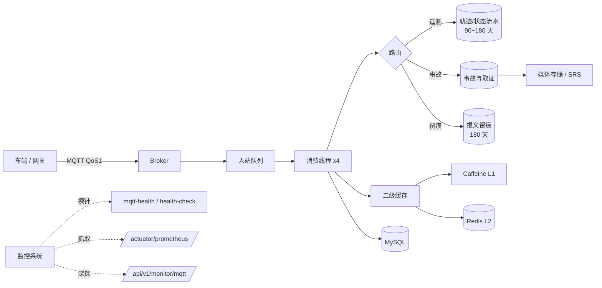

# DSSAD 云平台 · 运维手册与告警预案

> **文档定位**：把「平台跑起来之后怎么活」讲清楚 —— 巡检什么、看哪个指标、什么情况算故障、
> 出故障按哪个剧本处置、怎么发布回滚、怎么备份扩容。
>
> **读者**：一线值班同学、运维工程师、发布责任人、排障时的开发同学。
>
> **配套资产**（都已随代码入库，不是纸面方案）：
> `scripts/mqtt-watch.sh`（通道探针）、`scripts/health.sh`（业务冒烟）、
> `scripts/run-local.sh`（成品包起服与优雅停止）、`deploy/`（Nginx / systemd / Mosquitto 资产）。
>
> **事实口径**：本文所有阈值、路径、命令、缺陷编号均来自**代码复核或本机实测**。
> 无法在本机验证的（真实 Prometheus、真实 MySQL 主从、真实 Nginx、真实 S3）均**显式标注「未验证」**，
> 不用「配置看起来对」冒充「已验证」。

---

## 1. 运维对象与拓扑

### 1.1 进程与端口清单

| 组件 | 进程/容器 | 默认端口 | 对外暴露 | 说明 |
|------|-----------|----------|----------|------|
| 平台后端 | `dssad-cloud-platform.jar`（systemd `dssad-cloud-platform`） | 8080 | **仅内网**（经 Nginx 代理） | 唯一有业务状态的进程 |
| Nginx | `nginx` | 80 / 443 | 公网 | TLS 终止、`/api` 反代、`/actuator/` 返 404 |
| MySQL | `mysql` / 容器 | 3306 | **仅内网** | 业务数据主库（生产用 8.0.17+） |
| Redis | `redis` / 容器 | 6379 | **仅内网** | 多实例共享：令牌、去重、限流、二级缓存 L2 |
| MQTT Broker | `mosquitto` / 第三方 | 1883（或 8883） | 视组网 | 车端上行 + 平台下行 |
| SRS（流媒体） | 外部系统 | 1935 / 8080 | 视组网 | 事故取证视频拉流 |
| 媒体存储 | 本地盘或对象存储 | — | 经 Nginx `/media` | 文档约定单文件 ≤ 200MB |

> **安全基线**：MySQL 与 Redis **不对公网暴露**。生产编排里二者只接 `internal: true` 的网络，
> 应用容器不映射 `ports` 只 `expose` —— 否则可绕过 Nginx 与 TLS 直连后端。

### 1.2 依赖与失败影响

这张表回答「谁挂了会怎样」，是排障时判断影响面的第一张表：

| 依赖 | 挂掉后的表现 | 平台还能干什么 | 分级 |
|------|--------------|----------------|------|
| **MySQL** | 启动阶段直接失败（`ddl-auto=validate` + 连接失败 fail-fast）；运行中则所有查询与写入报 5xxx/9999 | 几乎不能；健康检查仍可能返回 UP | P0 |
| **Redis** | L2 缓存降级为仅 L1（Caffeine），多实例间令牌/去重/限流不再共享 | 单实例可用；多实例会出现「同一辆车重复入库」风险 | P0（多实例）/ P2（单实例） |
| **MQTT Broker** | 「探活全绿但收不到数据」（见 O-01） | 查询类接口完全可用，历史数据可查 | P0 |
| **SRS** | 取证视频无法拉流，`/accident-media` 相关流程报错 | 其他功能正常 | P1 |
| **媒体存储盘** | 上传失败（`STORAGE_ERROR` 5003）；轨迹写入不受影响 | 业务可用，取证链路断 | P0 |
| **监管平台** | 换取 MQTT 密码与上报失败（`UPSTREAM_ERROR` 5002）；**已连接的 MQTT 不受影响** | 本地功能正常，上报积压 | P1 |

### 1.3 部署形态

三种形态的运维命令不同，**别混用**：

| 形态 | 启动/停止 | 看日志 | 配置文件 |
|------|-----------|--------|----------|
| systemd（推荐） | `sudo systemctl start/stop/restart dssad-cloud-platform` | `journalctl -u dssad-cloud-platform -f`；文件 `/var/log/dssad/dssad-cloud-platform.log` | `/etc/dssad/dssad-cloud-platform.env`（`chmod 600`） |
| 容器 | `docker compose -f docker-compose.prod.yml up -d` / `down` | `docker compose logs -f app` | `.env` + compose 的 `environment` |
| 本机成品包（终验用） | `bash scripts/run-local.sh --bg` / `--stop` | `.run/app-<port>.log` | 环境变量或命令行参数 |

### 1.4 数据流与运维关注点



**运维视角的三个关键点**：

1. **链路是异步的**：车端 → Broker → 队列 → 消费线程 → 库。任何一段卡住，对外表现都是
   「数据没上来」，但根因完全不同 —— 所以必须能分别看到「连接面 / 管道面 / 数据面」三组指标
   （平台已经都暴露了，见 4.1）。
2. **队列积压 ≠ 故障，但丢弃 = 数据永久丢失**。积压时摘实例只会让积压更严重（因为实例不再消费），
   这是最容易做错的处置动作。
3. **磁盘是唯一不可逆资源**：轨迹约 14GB/天/千车。保留期与磁盘容量必须对账，
   否则某天凌晨会以「写入全失败」的形式爆出来。

---

## 2. 日常巡检

### 2.1 每日（约 5 分钟）

| # | 动作 | 命令 | 期望 |
|---|------|------|------|
| 1 | 业务冒烟 | `bash scripts/health.sh --base-url https://域名` | 14 项通过 |
| 2 | 通道探针 | `bash scripts/mqtt-watch.sh --base-url http://127.0.0.1:8080` | 退出码 0（**不是 10**） |
| 3 | 通道深探 | `bash scripts/mqtt-watch.sh --base-url http://127.0.0.1:8080 --deep` | 退出码 0，无积压无丢弃 |
| 4 | 看丢弃计数 | 大屏「运维监控」页或 `/api/v1/monitor/mqtt` 的 `inboundDropped` 等四项 | 全为 0 |
| 5 | 看磁盘 | `df -h /data /var/log` | `/data` < 80% |
| 6 | 看错误日志 | `grep -c ERROR /var/log/dssad/dssad-cloud-platform.log` | 与昨日同量级（突增才看） |
| 7 | 看清理任务 | `grep '\[留痕\]\|\[保留策略\]' /var/log/dssad/*.log \| tail` | 当日 03:00 / 03:30 各有记录 |

### 2.2 每周

| # | 动作 | 说明 |
|---|------|------|
| 1 | 通道指标趋势 | `reconnectAttempts` 是否在无人工干预下持续增长（网络不稳或凭据将过期） |
| 2 | 缓存命中率 | `/api/v1/monitor/cache` 的 `hitRate`，持续低于 50% 说明缓存被穿透（见 4.2） |
| 3 | 连接池 | `/actuator/prometheus` 的 `hikaricp_connections_pending`，非 0 即排队 |
| 4 | 慢查询 | MySQL `slow_query_log`，重点看 `track_point`、`mqtt_message_log` 的写入与大屏聚合查询 |
| 5 | 备份可用性 | 抽查最近一次全备能否 `mysql -e "select count(*) from vehicle"` 还原（见第 7 章） |
| 6 | 证书剩余期 | `openssl s_client -connect 域名:443 2>/dev/null \| openssl x509 -noout -dates` |

### 2.3 每月

| # | 动作 | 说明 |
|---|------|------|
| 1 | 容量对账 | 实际日增与 8.1 的预算对比，偏差 > 30% 要查原因（新车接入？采样率被改？） |
| 2 | 恢复演练 | 在隔离环境按 7.4 做一次恢复，记录实际 RTO |
| 3 | 保留期复核 | 磁盘增长率 × 保留天数 是否仍小于可用空间 |
| 4 | 告警有效性 | 人为制造一次通道断开（改 Broker 地址重启），确认告警真的响了 |
| 5 | 依赖盘点 | 监管平台凭据有效期、Broker 证书、SRS 可用性 |

> **第 4 项最关键**：从不演练的告警等于没有告警。演练方式见 8.3 末尾的「反向探针」。

---

## 3. 探活模型：三层 + 一层通道

### 3.1 四个端点的语义分工

这是本手册最重要的表 —— **平台刻意把「服务活着」和「数据在流」拆成两个信号**，
只看前两个就会踩 O-01 的坑。

| 端点 | 语义 | 断链时 | 无令牌 | 用途 |
|------|------|--------|--------|------|
| `/actuator/health/liveness` | 进程活着（**不含任何依赖**） | 200 UP | 是 | 编排 liveness，失败才重启 |
| `/actuator/health/readiness` | 可以接流量 | 200 UP | 是 | 编排 readiness，失败摘流 |
| `/api/v1/monitor/health-check` | 服务可用（**刻意不算 MQTT**） | 200 UP，但 `mqttConnected:false` | 是 | 负载均衡/业务探活 |
| `/api/v1/monitor/mqtt-health` | **数据通道是否通** | **503 DOWN** | 是 | 监控告警（本手册的核心） |
| `/actuator/health`（聚合） | 全部指示器聚合 | **仍 200 UP** | 是⚠️ | 不建议用于判定（见 3.2） |

### 3.2 为什么数据通道**不**做成 actuator 健康组（实测结论，勿改回）

最初的设计是把通道做成 `HealthIndicator` 并挂到 health group `mqtt`，实测结果是：

```
GET /actuator/health/mqtt  →  503  {"status":"DOWN","components":{"mqttChannel":{...}}}
GET /actuator/health       →  503  {"status":"DOWN","groups":["liveness","mqtt","readiness"]}   ← 副作用
```

**Spring Boot 的聚合端点始终包含所有已注册的 `HealthIndicator`，健康组的 `include` 只能往里加，
不能把它从聚合里摘出去**（官方文档口径 + 本机实测一致）。后果与设计意图正好相反：

- 任何用 `/actuator/health` 判活的编排/网关会把实例**摘流甚至重启**；
- 而 Broker 故障重启应用毫无用处 —— 典型的重启风暴。

最终方案：通道状态由业务探针端点 `/api/v1/monitor/mqtt-health` 表达（`DOWN` → HTTP 503），
三个好处：
① 不动聚合端点，liveness/readiness 不受数据通道影响；
② 该端点天然被 Nginx 的 `/api/` 规则代理，**不需要为此在 `/actuator/` 上开洞**
（生产 Nginx 把 `/actuator/` 整体 404，这是正确的收敛姿势）；
③ 与既有业务探针同源，运维只需记一个域名加一条路径。

### 3.3 通道探针 `scripts/mqtt-watch.sh`

```bash
# 主探针（无凭据，建议每分钟一次）
bash scripts/mqtt-watch.sh --base-url http://127.0.0.1:8080

# 深度检查（需凭据，建议每 5 分钟一次）：积压与丢弃
bash scripts/mqtt-watch.sh --base-url http://127.0.0.1:8080 --deep --backlog 2000

# 本地/开发态：未启用 MQTT 属正常
bash scripts/mqtt-watch.sh --allow-disabled
```

**退出码即故障分类**（不是 Nagios 三段码，映射见 4.3）：

| 退出码 | 含义 | 处置 |
|--------|------|------|
| 0 | 正常 | — |
| 10 | 通道未启用（`mqtt.enabled=false`） | **生产属配置错误**，立即查环境变量 |
| 20 | 通道断开 / 凭据致命错误 | 剧本 O-01 |
| 30 | 队列积压超阈值 | 剧本 O-06 |
| 40 | **已发生丢弃** | 剧本 O-06（最严重，数据不可恢复） |
| 90 | 探针侧问题（不可达/404/鉴权） | 先确认是不是监控配置或版本不对 |
| 91 | 参数错误 | 修脚本调用 |

**机器可读输出**（便于 Zabbix/自定义采集器正则提取）：

```
MQTT_WATCH base=http://127.0.0.1:8080 status=DOWN state=RECONNECTING reconnect=2 \
  inbound=0 offline=0 pendingAck=0 dropped=0 threshold=5000 reason=channel-down result=channel-down
```

**cron 示例**（每分钟主探针，每 5 分钟深探，输出进 syslog 便于和告警平台对接）：

```bash
* * * * * /opt/dssad/scripts/mqtt-watch.sh --base-url http://127.0.0.1:8080 --quiet || logger -t mqtt-watch "exit=$?"
*/5 * * * * /opt/dssad/scripts/mqtt-watch.sh --base-url http://127.0.0.1:8080 --deep --quiet --password "$DSSAD_ADMIN_PASSWORD" || logger -t mqtt-watch "deep exit=$?"
```

> 探针**无状态**：不在本地记「连续失败几次」。防抖动交给告警平台的持续时长/连续次数
> （Prometheus `for: 2m`、Zabbix trigger 连续 3 次）。写进脚本只会多一份需要同步维护的隐藏状态。

---

## 4. 监控指标与告警规则

### 4.1 指标来源

| 来源 | 内容 | 鉴权 | 备注 |
|------|------|------|------|
| `/actuator/prometheus` | JVM、HTTP、连接池、GC（78 个 HELP 指标） | 无（Nginx 已 404） | 需在**内网**直连 8080 抓取，或按需放行该路径 |
| `/actuator/metrics/<name>` | 单指标查询，排障用 | 无（同上） | 不建议监控系统依赖 |
| `/api/v1/monitor/mqtt` | 连接面 + 管道面 + 数据面全部计数 | **需令牌** | 深探与排障主入口 |
| `/api/v1/monitor/mqtt-health` | 通道状态（粗粒度） | 无 | 告警主信号 |
| `/api/v1/monitor/cache` | 各级命中率、限流配置 | 需令牌 | 缓存穿透的唯一可见入口 |
| `/api/v1/dashboard/overview` | 业务大盘（车辆、事故、任务） | 需令牌 | 业务侧趋势 |

### 4.2 关键指标与健康区间

| 指标 | 来源 | 正常 | 告警阈值 | 为什么这个阈值 |
|------|------|------|----------|----------------|
| `status` | mqtt-health | UP | DOWN 持续 2 分钟 | 指数退避重连（2s→60s）下，短闪断常态，2 分钟可滤掉抖动 |
| `droppedTotal` | mqtt | 0 | **> 0** | 丢弃不可恢复，一次即告警 |
| `inboundQueueSize + offlineQueueSize` | mqtt | < 1000 | > 5000 持续 5 分钟 | 离线队列上限 10000；过半说明消费跟不上 |
| `pendingAck` | mqtt | < 100 | > 500 | 待确认堆积说明下行或对端有问题 |
| `reconnectAttempts` | mqtt-health | 波动 | 10 分钟内持续增长 | 持续增长 = 从未连上，常见原因是凭据过期 |
| `hikaricp_connections_pending` | prometheus | 0 | > 0 持续 1 分钟 | 池上限 20；一旦排队，请求会在 3s 后大批失败 |
| `http_server_requests_seconds_count{outcome="SERVER_ERROR"}` | prometheus | < 0.1% | > 1% 持续 5 分钟 | — |
| `jvm_memory_used_bytes{area="heap"}` 老年代占比 | prometheus | < 75% | > 85% 持续 10 分钟 | 配合 `-Xmx4g`，逼近上限会引发 GC 风暴 |
| `hitRate` | cache | 70%~95% | < 50% 持续 10 分钟 | 生产 TTL 30s/60s 的真实预期区间（**不是**压测里的 99.86%） |
| 同盘可用空间 | node_exporter / df | > 20% | < 15%（`/data`） | 轨迹约 14GB/天/千车，见 8.1 |
| 定时任务日志 | 日志 | 每日有 | 24h 无记录 | 清理任务停摆 → 磁盘失控 |

### 4.3 告警分级

| 级别 | 判定 | 响应 | 通知 | 例子 |
|------|------|------|------|------|
| **P0** | 数据通道断 / 数据丢弃 / 主库不可用 / 磁盘将满 | 15 分钟内响应，2 小时内恢复或降级 | 电话 + 群 | `status=DOWN`、`droppedTotal>0`、`/data` < 5% |
| **P1** | 功能受损但数据未丢 / 缓存或连接池异常 | 1 小时内响应，当日解决 | 群 + 邮件 | 积压超阈、命中率骤降、SRS 不可用、上报失败 |
| **P2** | 趋势性风险 / 可自愈 | 次日处理 | 邮件/工单 | 证书 30 天内到期、命中率缓慢下降、日志盘 > 80% |

**分级与退出码映射**：`20`/`40` → P0；`30` → P1；`10` → 生产 P0、开发忽略；`90` → P2（先查监控自身）。

### 4.4 Prometheus 抓取与告警规则模板

> ⚠️ **未验证声明**：本机无 Prometheus/promtool，本节规则**未经真实 Prometheus 校验**（语法仅供参考）。
> 落地前请用 `promtool check rules` 校验，并在预发环境跑通一次静默告警。

抓取配置（`scrape_configs`，抓的是内网 8080，不经 Nginx）：

```yaml
scrape_configs:
  - job_name: dssad-app
    metrics_path: /actuator/prometheus
    static_configs:
      - targets: ["10.0.0.11:8080"]     # 直连后端，勿走 Nginx（/actuator/ 已 404）
    relabel_configs:
      - source_labels: [__address__]
        target_label: instance
```

告警规则（`dssad-alerts.yml`）：

```yaml
groups:
  - name: dssad-platform
    rules:
      # ---- 数据通道：探针端点（HTTP 503），blackbox 或自研 exporter ----
      - alert: DssadMqttChannelDown
        expr: probe_success{job="dssad-mqtt-probe"} == 0
        for: 2m                                # 滤掉指数退避下的短闪断
        labels: { severity: P0 }
        annotations:
          summary: "DSSAD 数据通道断开（收不到车端数据）"
          runbook: "运维手册 剧本 O-01"

      - alert: DssadMqttDisabledInProd
        expr: probe_http_status_code{job="dssad-mqtt-probe"} == 200
              and on(instance) probe_dssad_mqtt_disabled == 1
        for: 5m
        labels: { severity: P0 }
        annotations:
          summary: "生产环境 MQTT 未启用（配置错误，平台收不到任何数据）"

      # ---- 应用内指标（micrometer，经 /actuator/prometheus） ----
      - alert: DssadDbPoolSaturated
        expr: hikaricp_connections_pending{pool="dssad-hikari"} > 0
        for: 1m
        labels: { severity: P0 }
        annotations:
          summary: "数据库连接池已排队（池上限 20，请求将在 3s 后失败）"

      - alert: DssadHttpServerErrors
        expr: |
          sum(rate(http_server_requests_seconds_count{outcome="SERVER_ERROR"}[5m]))
            / sum(rate(http_server_requests_seconds_count[5m])) > 0.01
        for: 5m
        labels: { severity: P1 }

      - alert: DssadHeapPressure
        expr: |
          sum(jvm_memory_used_bytes{area="heap"}) / sum(jvm_memory_max_bytes{area="heap"}) > 0.85
        for: 10m
        labels: { severity: P1 }

      # ---- 依赖与主机（node_exporter / mysqld_exporter） ----
      - alert: DssadMediaDiskFilling
        expr: (node_filesystem_avail_bytes{mountpoint="/data"} / node_filesystem_size_bytes{mountpoint="/data"}) < 0.15
        for: 10m
        labels: { severity: P1 }

      - alert: DssadMysqlReplicationLag
        expr: mysql_slave_status_seconds_behind_master > 30
        for: 5m
        labels: { severity: P1 }
```

**业务计数（积压/丢弃）为什么不在上面**：它们是应用内的计数器，**没有导出为 Prometheus 指标**，
因此只能通过 `mqtt-watch.sh --deep` 采集。两种落地方式：

1. 用 textfile collector 落盘（推荐，见下方脚本片段）；
2. 或把 MQTT 通道计数补成 micrometer 指标（改动代码，当前未做）。

```bash
# /etc/cron.d/dssad-metrics —— 每分钟生成 textfile 指标，node_exporter 的 textfile collector 会抓走
* * * * * root /opt/dssad/scripts/mqtt-watch-export.sh > /var/lib/node_exporter/textfile/dssad_mqtt.prom
```

> `mqtt-watch-export.sh` **本手册未提供**（属待补资产，见 10. 缺陷清单 **O-04**）：
> 它的实现要点是把 `mqtt-watch.sh --json` 的输出转成
> `dssad_mqtt_queue_size{kind="inbound"} 0` 这类文本行，并在探针失败时输出 `dssad_mqtt_probe_success 0`。

### 4.5 抑制与防抖

| 场景 | 处理 |
|------|------|
| Broker 维护窗口 | 提前静默 `DssadMqttChannelDown`，窗口结束后确认恢复 |
| DB 主从切换 | 抑制从库延迟告警，只留主库判定 |
| 发布期间 | 发布前静默 5 分钟，发布后立即手动跑一次 `health.sh` + `mqtt-watch.sh` |
| 清理窗口（03:00–04:00） | 抑制由磁盘 IO / 慢查询引发的 P1（此时批量删除会持续占用 IO，属预期） |

---

## 5. 应急预案（剧本）

剧本格式统一为：**现象 → 判定（怎么确认是它） → 处置（按顺序做） → 验证（怎么算恢复了） → 易误判**。

### 剧本 O-01：MQTT 通道断开（收不到车端数据）

- **现象**：面板车辆全部置灰或数据不更新；`mqtt-watch.sh` 退出码 20；`/api/v1/monitor/mqtt-health` 返回 503。
- **判定**：

```bash
bash scripts/mqtt-watch.sh --base-url http://127.0.0.1:8080        # 得到 state 与 reason
grep -E "\[MQTT\]" /var/log/dssad/dssad-cloud-platform.log | tail -20
```

看 `reason` 分两条完全不同的路：

| reason | 含义 | 处置 |
|--------|------|------|
| `channel-down` | 网络/Broker 问题，应用在按 2s→60s 指数退避重连 | ① 查 Broker 进程与 1883 连通性 `telnet broker 1883`；② 查网络策略/防火墙；③ 查 Broker 是否限流踢客户端（clientId 冲突也会导致互踢，见易误判） |
| `credentials-or-config-failed` | 凭据换取失败等**致命**错误，重连不会自愈 | ① 查监管平台可达性；② 查企业凭据有效期；③ 修正配置后**必须重启**（状态已置 FAILED） |

- **验证**：探针退出码回到 0，且 `reconnect=0` 之后不再增长；在面板上看到车辆数据更新。
- **易误判**：
  - `health-check` 仍返回 200 是**设计如此**，不代表通道正常（这正是 O-01 要解决的问题）；
  - 日志里 `[MQTT] 未取得 MQTT 密码且无静态配置，将以匿名方式连接` 说明凭据链路先挂了，
    匿名连接在多数 Broker 上会被拒 —— 先修凭据，别急着查网络；
  - **clientId 冲突**：两个实例用同一 `clientId` 会互相踢线，表现为「连上又断」无限循环。
    多实例部署必须保证 `clientId` 唯一（`dssad.mqtt.client-id-prefix` + 实例标识）。

### 剧本 O-02：MySQL 不可用 / 主从延迟

- **现象**：接口大面积 5xxx/9999；日志大量 `Communications link failure`；连接池 pending 持续 > 0。
- **判定**：

```bash
mysqladmin -h $DB_HOST -u $DB_USERNAME -p ping
mysql -h $DB_HOST -u $DB_USERNAME -p -e "show slave status\G" | grep -E "Running|Behind"
grep -cE "Communications link failure|Connection is not available" /var/log/dssad/*.log
```

- **处置顺序**（**先止血再找根因**）：
  1. 确认是主库还是从库；从库延迟只影响读一致性，把读流量切主库可缓解（本平台未做读写分离，通常忽略）；
  2. 主库不可用：等待 DB 侧恢复（重启/切换），**不要重启应用** —— 应用会自动重连，重启只会丢掉内存中的在途批量（会以「少量轨迹点丢失」的形式出现）；
  3. 恢复后确认离线队列与在途批量是否已落库（看 `droppedTotal` 与 `trackPointsPersisted` 是否继续增长）。
- **验证**：`health.sh` 14 项通过；`hikaricp_connections_pending` 归零。
- **易误判**：连接池 `connection-timeout: 3000`（3 秒）很短 —— DB 抖动时表现为 **3 秒后大批 500**，
  而不是「慢慢超时」。看到大量 3 秒整的请求耗时，直接去看 DB，不用怀疑代码。

### 剧本 O-03：Redis 不可用（L2 降级）

- **现象**：单实例仍可用；多实例下出现「同一报文重复入库」或令牌校验异常；`/api/v1/monitor/cache` 的
  `mode` 从 `L1(Caffeine)+L2(Redis)` 变成只剩 L1。
- **判定**：`redis-cli -h $REDIS_HOST -a $REDIS_PASSWORD ping` → 期望 `PONG`。
- **处置**：
  1. 单实例：可继续服务，按 P2 处理，但**必须**尽快恢复 —— L2 承担跨实例一致性；
  2. 多实例：**立即摘除非必要实例**（只保留一个）或整体切到单实例模式，避免重复入库污染监管数据；
  3. Redis 数据丢失后无需数据修复，但需确认去重窗口已重建（新的报文开始正常入库）。
- **验证**：`cache` 接口的 `mode` 恢复双级；观察 5 分钟无重复记录（按 `msgId` 去重命中数是间接证据）。
- **易误判**：Redis 恢复后**旧令牌全部失效**（令牌默认存 Redis）→ 前端表现为突然全部要求重新登录，
  这是预期行为，不是新故障。

### 剧本 O-04：磁盘写满

- **现象**：媒体上传报 5003；日志刷 `No space left on device`；MySQL 可能进入只读。
- **判定**：

```bash
df -h /data /var/log /var/lib/mysql
du -sh /data/dssad/media /var/log/dssad          # 谁在吃空间
du -sh /var/lib/mysql/dssad_cloud                # 哪个库/表最大
```

- **处置**（按恢复速度排序）：
  1. **日志先救急**（最安全）：`journalctl --vacuum-size=500M`；确认 `logback` 滚动已生效
     （`max-file-size: 200MB` / `max-history: 30` / `total-size-cap: 10GB`）；
  2. **媒体文件**：按取证保留要求清理最老的归档（**先确认已备份/已上报，再删**）；
  3. **遥测流水**：手动触发保留策略清理，或临时调小 `DSSAD_TRACK_RETENTION_DAYS`；
  4. MySQL binlog：确认已有备份后 `PURGE BINARY LOGS BEFORE ...`。
- **验证**：可用空间恢复到 20% 以上；上传恢复正常；MySQL 可写。
- **易误判**：
  - **不要**先删数据表（`TRUNCATE` 不可回滚，且监管取证要求保留期内数据不可删）；
  - 清理窗口是 03:00（留痕）与 03:30（遥测），单批 5000 行 —— 磁盘告警在窗口前最紧张，
    窗口后回落属预期，别当成两起故障。

### 剧本 O-05：OOM / GC 风暴

- **现象**：进程被 systemd 重启（`Restart=on-failure`）；`/var/log/dssad/heapdump.hprof` 出现；
  接口 P50 明显上升。
- **判定**：

```bash
journalctl -u dssad-cloud-platform --since "1 hour ago" | grep -iE "oom|killed|exit"
ls -lh /var/log/dssad/heapdump.hprof
curl -s --noproxy '*' http://127.0.0.1:8080/actuator/prometheus | grep -E "^jvm_gc|^jvm_memory_used_bytes" | head
```

- **处置**：
  1. 保留 heapdump 再重启（默认参数已指向 `/var/log/dssad`）；
  2. 检查是否发生「大批量查询把整表拉进内存」——看请求日志里有没有 `size` 很大的分页（接口限了 `max-page-size`，但导出类接口需单独确认）；
  3. 检查 `offlineCacheSize`（默认 10000）在长时间断链时是否被填满（这是设计内的内存占用，但会叠加）；
  4. 若为长期增长 → 属泄漏，需带 heapdump 走开发流程，**不要**只调大 Xmx 了事。
- **验证**：重启后 10 分钟内 GC 暂停恢复正常；`jvm_memory_used_bytes` 呈锯齿而非持续攀升。
- **易误判**：`systemd` 的 `Restart=on-failure` 会让 OOM 表现为「服务自己好了」，掩盖问题 ——
  必须看 `journalctl` 的退出码，`kill -9`/OOM 的退出码是 137。

### 剧本 O-06：队列积压与数据丢弃

- **现象**：`mqtt-watch.sh` 退出码 30（积压）或 40（丢弃）；`inboundQueueSize` 持续增长。
- **判定**：

```bash
bash scripts/mqtt-watch.sh --base-url http://127.0.0.1:8080 --deep --json
curl -s --noproxy '*' -H "X-Token: $TOKEN" http://127.0.0.1:8080/api/v1/monitor/mqtt
```

区分两种根因：

| 特征 | 根因 | 处置 |
|------|------|------|
| `connected=true` 且积压增长 | 消费跟不上（慢 SQL / 磁盘慢 / 线程不够） | 查慢查询与磁盘 IO；必要时调 `consumerThreads`（默认 4）或扩容实例 |
| `connected` 反复 true/false | 通道抖动导致反复重连，重连期间消费停滞 | 按 O-01 处理通道 |
| 已出现 `droppedTotal > 0` | 上游已按超时重发过，**数据有断档** | ① 记录丢弃量与时间窗；② 通知业务方该时段数据不完整；③ 评估是否触发对端补传 |

- **验证**：积压在 10 分钟内回落到阈值以下；`droppedTotal` 不再增长。
- **易误判**：
  - **摘实例不会缓解积压**，只会让剩下的实例压力更大（消费端水平扩展才有效）；
  - 低优先级数据是被**故意**丢弃的（`offlineDroppedLowPriority`），它是设计内的取舍，
    但**必须告警** —— 因为它意味着「已经发生过一次数据缺失」，只是丢的不是关键数据。

### 剧本 O-07：监管平台对接失败

- **现象**：`UPSTREAM_ERROR` 5002；日志 `[监管平台] 调用失败 path=...`。
- **判定**：`curl -sS -o /dev/null -w '%{http_code}\n' $DSSAD_REGULATORY_BASE_URL/passport/...`。
- **处置**：
  1. 确认对端是否公告维护；
  2. 检查平台侧凭据（企业 ID / 密钥）是否被更换或过期；
  3. 上报类失败会在重试机制内自愈（`Retry` 配置：确认 5s×3 次、无效 3s×5 次），
     不必人工重放；**换取 MQTT 密码失败**则会影响通道，按 O-01 处理。
- **验证**：日志不再出现 5002；MQTT 通道状态稳定。
- **易误判**：`换取 MQTT 密码失败` 的日志是 `ERROR` 级别但**通道可能仍正常**（已连接的会话不受影响），
  不要仅凭一条 ERROR 就重启服务 —— 重启会真的把连接断掉。

### 剧本 O-08：TLS 证书过期 / Nginx 5xx

- **现象**：浏览器证书告警；接口 502/504。
- **判定**：

```bash
openssl s_client -connect 域名:443 -servername 域名 </dev/null 2>/dev/null | openssl x509 -noout -dates
nginx -t && tail -50 /var/log/nginx/error.log
curl -s -o /dev/null -w '%{http_code}\n' --noproxy '*' http://127.0.0.1:8080/api/v1/monitor/health-check   # 后端本身是否活着
```

- **处置**：
  1. 证书：替换后 `nginx -s reload`（**必须确认新证书文件已存在且权限可读**，否则 reload 失败而旧进程继续跑，
     表现为「换了证书但网站打不开」）；
  2. 502：后端未起来或端口不对 → 先直连 8080 确认，再查 Nginx `proxy_pass`；
  3. 504：看 `proxy_read_timeout 120s` 是否被长查询突破（大屏跨月聚合是常见触发点），
     确认是慢查询就优化查询而不是无限加大超时。
- **验证**：`curl -I https://域名/` 返回 200；证书日期已更新。
- **易误判**：Nginx 配置错误时 `nginx -t` **不报错但 reload 不生效**的情况多见于证书缺失 ——
  始终用 `curl` 端到端验证，而不是只看 `nginx -t` 的结果。

### 剧本 O-09：多实例重复执行定时任务

- **现象**：清理任务日志在同一时刻出现多份；`MapBarrierService` 的每日任务重复执行。
- **背景**：平台有 5 个 `@Scheduled` 任务（见附录 B.3），其中遥测刷新与 ACK 重试是秒级的、
  只应在**单实例**语义下运行；当前**没有分布式锁**（缺陷 P-01）。
- **处置**：
  1. 多实例部署时，用部署层规避：把秒级任务（`fixedDelay=1s` 的遥测刷新与 ACK 重试）
     限制为**只在「主实例」开启**（通过环境变量注入一个「是否启用定时任务」的开关，
     当前代码未提供该开关 → 属待补能力）；
  2. 或接受「多实例重复执行」并保证任务幂等（清理任务天然幂等；ACK 重试需确认不会重复下发）。
- **验证**：同一时刻仅一个实例输出任务日志。
- **易误判**：清理任务重复执行的**后果不严重**（幂等），但 ACK 重试重复执行可能导致**重复下行**，
  需要重点确认。

---

## 6. 发布与回滚 SOP

### 6.1 发布前检查清单

- [ ] `bash scripts/check-env.sh` 通过（环境问题会伪装成代码问题）
- [ ] `mvn verify` 通过（含覆盖率门槛 0.60，实测 `All coverage checks have been met`）
- [ ] 若实体有改动：`db/schema-mysql.sql` 已同步（**不同步 → 生产启动直接失败**，见 6.4）
- [ ] 已在**隔离环境**用 prod profile + 真实 MySQL 起过一次（`scripts/run-local.sh --prod`）
- [ ] 数据库已备份（见 7.2）
- [ ] 发布窗口避开 03:00–04:00 清理窗口
- [ ] 告警静默已开，回滚负责人已确定
- [ ] `DSSAD_ADMIN_PASSWORD` 等密钥已在配置中覆盖（不能是开发默认口令）

### 6.2 发布步骤

**systemd 形态（推荐）**

```bash
# 1. 上传新 jar 到临时名，避免覆盖正在运行的包
scp target/dssad-cloud-platform.jar server:/opt/dssad/dssad-cloud-platform.jar.new

# 2. 原子替换 + 重启（mv 在同一文件系统上是原子的，避免半包）
ssh server 'cd /opt/dssad \
  && cp dssad-cloud-platform.jar dssad-cloud-platform.jar.bak \
  && mv dssad-cloud-platform.jar.new dssad-cloud-platform.jar \
  && systemctl restart dssad-cloud-platform \
  && sleep 20 && systemctl is-active dssad-cloud-platform'

# 3. 验证
bash scripts/health.sh --base-url https://域名 --no-simulator
bash scripts/mqtt-watch.sh --base-url http://内网IP:8080
```

**容器形态**

```bash
docker compose -f docker-compose.prod.yml build app
docker compose -f docker-compose.prod.yml up -d app       # 滚动：depends_on service_healthy 会先等依赖
docker compose -f docker-compose.prod.yml logs -f app
```

**本机终验（上线前最后一道）**

```bash
bash scripts/build.sh --web          # 含测试与覆盖率
bash scripts/run-local.sh --prod     # prod profile；缺必填环境变量会直接报错而不是起半残实例
bash scripts/health.sh --base-url http://127.0.0.1:8080 --no-simulator
bash scripts/run-local.sh --stop     # SIGTERM → 优雅停机 → 确认端口释放
```

> `--no-simulator` 是**必须**的：模拟器会凭空写入事故与故障记录，污染监管取证链路。

### 6.3 回滚

| 情形 | 动作 |
|------|------|
| 应用异常、表结构未变 | 回滚 jar（`.jar.bak`）+ 重启，5 分钟内可完成 |
| 应用异常、表结构已变（含新增列/表） | **先回滚应用**，再评估表结构：新增列/表通常可保留（旧应用不读不写），删除/改名必须回滚 |
| 数据被写坏 | 停写 → 从备份恢复受影响表 → 核对时间窗内数据是否与车端补传冲突 |

```bash
ssh server 'cd /opt/dssad && cp dssad-cloud-platform.jar.bak dssad-cloud-platform.jar \
  && systemctl restart dssad-cloud-platform && sleep 20 && systemctl is-active dssad-cloud-platform'
bash scripts/health.sh --base-url https://域名 --no-simulator
```

**判定标准**：`health.sh` 14 项通过 + 通道探针退出码 0 + 面板数据在更新，三者齐全才算回滚成功。

### 6.4 DDL 漂移（生产启动失败的常见根因）

生产 profile 使用 `ddl-auto=validate`：**JPA 实体与真实表结构必须完全一致，否则拒绝启动**。
这是刻意设计的门禁（比带着错表结构跑起来好），本机已用**空库反向探针**证明它真的在拦：

```bash
# 期望：退出码非 0 + Schema-validation: missing table，且日志里没有 "Tomcat started"
DB_NAME=空库 java -jar dssad-cloud-platform.jar --spring.profiles.active=prod
```

改过实体就必须同步建表脚本：

```bash
mvn test -Dtest=SchemaDdlGeneratorTest -Dddl.gen=true   # 产出 schema-mysql.generated.sql
diff db/schema-mysql.generated.sql db/schema-mysql.sql  # 与本文件比对后再提交
```

发版时如果卡在 `Schema-validation`，处置顺序是：
① 按上一步 diff 出差异 → ② 人工审核 DDL（确认不会锁表/丢数据）→ ③ 在低峰执行 → ④ 重启验证。
**不要**为了「先跑起来」把 `ddl-auto` 改成 `update`（生产自动改表是事故来源）。

---

## 7. 备份与恢复

### 7.1 备份对象与频率

| 对象 | 频率 | 保留 | 方式 |
|------|------|------|------|
| MySQL 全量 | 每日 01:00（避开 03:00 清理窗口） | 30 天 | `mysqldump --single-transaction` |
| MySQL binlog | 持续 | 7 天 | 用于时间点恢复（PITR） |
| 媒体文件 `/data/dssad/media` | 每周增量 | 按取证要求 | rsync / 对象存储同步 |
| 配置 `/etc/dssad/*.env` | 变更即备份 | 长期 | 加密后入库（**含口令，禁止明文进 git**） |
| 建表脚本 `db/schema-mysql.sql` | 随代码 | 长期 | git 已有 |

### 7.2 MySQL 备份与校验

**用仓库内的 `scripts/backup.sh`（推荐，已实测）**：

```bash
# 日常备份（凭据从 --env-file 或环境变量 / 仓库 .env 读取）
bash scripts/backup.sh --out /backup/dssad --keep 30 \
  --env-file /etc/dssad/dssad-cloud-platform.env

# 附带**真恢复演练**：把备份还原到临时库、比对表数、再自动删除临时库
bash scripts/backup.sh --out /backup/dssad --keep 30 --restore-check \
  --env-file /etc/dssad/dssad-cloud-platform.env

# 预演：只打印将执行的命令（口令一律以 *** 掩码），不产生任何写入
bash scripts/backup.sh --dry-run
```

三类手工命令最容易漏掉的事，脚本各有硬措施：

| 环节 | 裸 `mysqldump > x.sql` 的风险 | 脚本的措施 |
|------|------------------------|-----------|
| 一致性 | 不加 `--single-transaction` 会对 MyISAM 表加全局读锁，**高峰备份 = 一次故障** | 默认加上；并加 `--quick` 流式读取，不把整表结果集堆进客户端内存 |
| 完整性 | 进程被杀 / 连接断开会留下**语法完整、内容截断**的 `.sql`，直到真要恢复时才发现 | ① `gzip -t` 完整性；② 结尾必须存在 `Dump completed` 收尾标记；③ `CREATE TABLE` 计数与库中实际表数比对 |
| 磁盘 | 不轮转会先把磁盘写满，然后**应用先挂**（告警指向数据库空间不足，真因却是备份堆积） | `--keep N` 只保留最近 N 份；且只删本脚本自己命名的文件（不做通配符删除） |

**注册定时任务**（脚本已就绪，注册动作需人工执行一次）：

```bash
# /etc/cron.d/dssad-backup
# 每日 01:00 —— 避开 03:00 留痕清理、03:30 遥测清理、00:05 地图拉取
0 1 * * * root cd /opt/dssad && /bin/bash scripts/backup.sh --out /backup/dssad --keep 30 --env-file /etc/dssad/dssad-cloud-platform.env >> /var/log/dssad/backup.log 2>&1
# 每月 1 日 02:00 —— 真恢复演练（这是巡检项，不是可选项：没恢复过的备份不算备份）
0 2 1 * * root cd /opt/dssad && /bin/bash scripts/backup.sh --out /backup/dssad --keep 30 --restore-check --env-file /etc/dssad/dssad-cloud-platform.env >> /var/log/dssad/backup.log 2>&1
```

**接监控**：脚本最后一行是机器可读摘要，成功与失败各一种，可直接被采集：

```
BACKUP_OK file=/backup/dssad/dssad_cloud_20260923_105452.sql.gz size_bytes=5552 tables=13 duration_s=1 restore_check=ok kept=30
BACKUP_FAIL stage=verify reason=truncated
```

> `stage` 与告警级别的对应：`connect`（凭据/网络）→ P1；`dump`（导出失败）→ P1；
> **`verify` → P0** —— 它意味着「备份已不可用，下一个需要恢复的时刻会失败」；
> `restore-check` → P1；`rotate` → P2（不影响当下，但磁盘会持续增长）。

**排障时的手工核对通路**（原理与脚本一致，用于交叉验证）：

```bash
# 一致性与完整性
gzip -t /backup/dssad/dssad_cloud_20260923_105452.sql.gz && echo "压缩包完整"
gzip -dc /backup/dssad/xxx.sql.gz | tail -c 4096 | grep -c "Dump completed"   # 必须为 1

# 表数比对（转储内 vs 库内）
gzip -dc /backup/dssad/xxx.sql.gz | grep -c '^CREATE TABLE'
mysql -h 127.0.0.1 -u root -p -N -B -e \
  "SELECT COUNT(*) FROM information_schema.tables WHERE table_schema='dssad_cloud'"
```

> 本机验证过的同类操作：把 `db/schema-mysql.sql` 打到真实 MySQL 8.4 上得到 **13 表 / 47 索引**、
> 零报错，并用空库反向探针确认 `ddl-auto=validate` 门禁有效。
> `backup.sh` 亦在真实 MySQL 8.4 上实测：13 表库备份 → 三重校验通过 → 恢复演练表数一致 →
> 连跑 3 次后按 `--keep 2` 正确清理；并用**截断文件反例**验证了「`gzip -t` 失败 +
> `Dump completed` 命中 0 次」确实能被判据识别。

### 7.3 媒体与配置

```bash
rsync -a --delete-after /data/dssad/media/ backup@nas:/backup/dssad/media/
cp /etc/dssad/dssad-cloud-platform.env /backup/config/$(date +%F).env && chmod 600 /backup/config/$(date +%F).env
```

### 7.4 恢复演练（每月一次）

| 步骤 | 命令/动作 | 期望 |
|------|-----------|------|
| 1 | 起一个空 MySQL | — |
| 2 | 导入最近全备 | 无报错 |
| 3 | 应用 prod profile 对着它启动 | ① `ddl-auto=validate` 通过；② 能查到车辆与事故数据 |
| 4 | 记录耗时 | 即 **RTO 实测值** |
| 5 | 清理演练环境 | 确认没有残留库 |

**目标值（需按实际容量校准）**：RPO ≤ 24 小时（全备）+ 秒级（binlog）；RTO ≤ 1 小时。

> 演练环境必须与生产隔离。本机做同类验证时用的临时库（`dssad_cloud_verify`、`dssad_empty_probe`）
> 已在使用后 `DROP` 清理。

---

## 8. 容量与扩容

### 8.1 磁盘预算（千车规模）

| 数据 | 日增（估算依据） | 保留 | 稳态占用 |
|------|------------------|------|----------|
| 轨迹点 `track_point` | 1000 台 × 1Hz ≈ **8640 万行/天**，约 **14GB/天** | 90 天 | ≈ 1.26 TB |
| 状态流水 `state_snapshot` | 与上报频率相关 | 180 天 | 视采样而定 |
| 报文留痕 `mqtt_message_log` | `audit.mode=sampled`、`sample-rate=0.05` 后 ≈ 432 万条/天 | 180 天 | ≈ 与轨迹同量级 |
| 媒体（事故视频） | 每起事故 4 路 × 2 分钟 ≈ 数百 MB | 按取证要求 | 波动大，需单独监控 |
| 日志 | ≤ 10GB（`total-size-cap` 已封顶） | 30 个文件 | ≤ 10 GB |

> **留痕模式的取舍**：`audit.mode=full` 时 1000 台车 1Hz 全量留痕 ≈ 8640 万条/天，
> 生产默认是 `sampled`（5%）。**改这个开关必须同步评估磁盘**，它是磁盘增长最快的单一变量。
>
> **保留期与磁盘的关系**：`retention.track-point-days=90` 与 `state-snapshot-days=180` 的默认值
> 是按存储预算反推的，不是随口给的。调大保留期前先算「日增 × 天数 < 可用空间 × 0.8」。

### 8.2 连接与并发

| 参数 | 当前值 | 说明 |
|------|--------|------|
| Tomcat 线程 | `max: 200`，`min-spare: 20` | 虚拟线程开启后它不再是真正的并发上限 |
| 虚拟线程 | prod 开启 | 阻塞式 IO 不再吃线程 |
| Hikari 连接池 | `maximum-pool-size: 20`，`min-idle: 5` | **真正的唯一排队点**；`connection-timeout: 3000` |
| 入站消费线程 | `consumer-threads: 4` | 隔离 MQTT 回调线程 |
| 离线队列 | `offline-cache-size: 10000` | 断链期间的缓冲，超出按优先级丢弃 |
| 缓存 | L1 `max-size: 50000`，L1 TTL 30s，L2 TTL 60s | — |
| 限流 | HTTP 100 次/分钟·车，MQTT 10 条/秒·车 | 文档 9.1 约定 |

**关键结论**：压测显示（见性能报告）虚拟线程启用后突发流量的表现是
**「3 秒后大批失败」而非「排队等待」** —— 因为 Hikari 的 20 个连接是唯一排队点，
`connection-timeout` 一到就批量失败。因此**连接池 pending > 0 必须 P0 告警**。

### 8.3 扩容判定与步骤

| 信号 | 结论 | 动作 |
|------|------|------|
| CPU 持续 > 70% 且连接池 pending = 0 | 计算瓶颈 | 加实例（无状态，可水平扩展） |
| 连接池 pending > 0 且 DB CPU < 60% | 池上限瓶颈 | 提高 `maximum-pool-size`（**同时确认 DB 的 max_connections**） |
| 积压增长且消费线程满载 | 消费瓶颈 | 提高 `consumer-threads` 或加实例 |
| 磁盘 > 85% | 容量瓶颈 | 扩容磁盘 / 缩短保留期 / 归档冷数据 |
| 多实例部署 | 一致性要求 | **必须** `dssad.redis.enabled=true`（去重/限流/令牌跨实例共享） |

**扩容后必做**：确认新实例的 `clientId` 唯一（否则互踢，见 O-01 易误判）；
确认只有预期数量的实例在跑定时任务（见 O-09）。

**反向探针（每月演练）**：人为把 `DSSAD_MQTT_BROKER_URL` 改成一个不存在的地址重启实例，
确认 `mqtt-watch.sh` 退出码变 20、告警真的响了、而 `/actuator/health` 与编排探测**不受影响**
（这三条都通过才算告警链路合格）。恢复后把地址改回。本机已用这种方式实测：

```
[失败] 通道 DOWN：state=RECONNECTING reason=channel-down（已重连 2 次）
MQTT_WATCH ... status=DOWN ... result=channel-down     exit=20
GET /actuator/health  → 200 UP      ← 编排不受影响（刻意设计）
GET /api/v1/monitor/health-check → 200（mqttConnected:false）  ← 原始 E-01 场景
```

---

## 9. 值班手册

### 9.1 交接与上报

- **交接**：当前告警状态、正在处理的事项、已静默的告警与静默原因、下次维护窗口。
- **上报**：P0 立即进群并电话通知负责人；P1 进群；P2 记工单。
- **禁止**：在未确认影响面前重启生产实例（重启会丢掉内存中的在途批量与登录态）。

### 9.2 常见误判清单

| 看到的 | 真实含义 | 别做什么 |
|--------|----------|----------|
| `health-check` 200 但面板没数据 | 通道断了（**设计如此**） | 别以为「服务正常，是前端问题」 |
| 日志一条 `ERROR [监管平台] ...` | 换取凭据失败，通道可能仍正常 | 别仅凭一条 ERROR 重启服务 |
| 请求耗时恰好 3 秒后失败 | Hikari `connection-timeout` 触发 | 别去查代码，直接查 DB |
| 缓存命中率 99% | 短窗口 + 短 TTL 造成的假象（压测口径） | 别拿它当生产预期，生产看 70%~95% |
| Redis 恢复后全员掉登录 | 令牌存 Redis，属预期 | 别当成新故障上报 |
| 03:00 后磁盘回落 | 清理任务正常执行 | 别当成两起故障 |
| 服务「自己好了」 | 可能是 OOM 被 systemd 重启 | 别跳过 `journalctl` 的退出码（137 = 被杀） |

### 9.3 复盘

每次 P0/P1 后 3 个工作日内出复盘，必须包含：
① 时间线（发现→定位→止血→恢复）；② **为什么监控没提前发现**（是否缺指标/阈值不对）；
③ 处置中做错的动作；④ 手册/脚本要改的具体条目（写明改哪一节）。

---

## 10. 风险与缺陷清单（O 系列）

> 编号规则：`O-xx` 为本手册发现的运维侧问题。均已按代码复核或本机实测确认，不含推测。

| 编号 | 级别 | 问题 | 证据 | 状态 |
|------|------|------|------|------|
| **O-01** | **高** | **探活不覆盖数据通道**：Broker 断开时 liveness/readiness/health-check 全部成功，平台一条数据收不到却「全绿」 | 实测：断链时 `health-check` 200（`mqttConnected:false`）、`liveness` 200 | ✅ **已修复**：新增 `GET /api/v1/monitor/mqtt-health`（DOWN → 503）+ `scripts/mqtt-watch.sh` + 8 个单测 |
| **O-02** | 中 | **`/actuator/prometheus` 声明了但不存在**：`management.endpoints.web.exposure.include` 里写了 `prometheus`，pom 却没有 `micrometer-registry-prometheus` → 端点 404，抓取端全空且不报错 | 修复前实测 404；修复后 200 且 **78 个 HELP 指标** | ✅ **已修复**：补依赖 |
| **O-03** | **高** | ~~`/actuator/**` 无任何应用层鉴权~~ | 复核时：`AdminTokenInterceptor` 只注册在 `/api/v1/**` 上，它内部的 `uri.startsWith("/actuator")` 分支**永不执行**（死代码）；全仓无 CIDR/白名单类 | ✅ **已修复**：新增 `ActuatorIpWhitelistFilter`（来源 IP 白名单，fail-closed）+ `IpCidrMatcher` + 25 个单测。判定基于 **TCP 对端地址**，**不采信 `X-Forwarded-For`**（`forward-headers-strategy=framework` 会把 XFF 还原进 `getRemoteAddr()`，直接读它等于留一个伪造绕过口子，已有专门回归用例 `rejectsSpoofedForwardedHeader`）。白名单外一律返回 **404**（不确认端点存在）；配非法 CIDR **启动即失败**；配空列表 = **全拒**。配置项 `dssad.security.actuator.allowed-cidrs` / 环境变量 `DSSAD_ACTUATOR_ALLOWED_CIDRS` |
| **O-04** | 中 | **无 Prometheus 抓取与告警落地**：4.4 的规则未在真实 Prometheus 校验；积压/丢弃计数**未导出为 Prometheus 指标**，只能靠脚本采集 | 本机无 Prometheus/promtool | ⚠️ **部分**：规则模板已给；`mqtt-watch-export.sh`（textfile 导出）**待补** |
| **O-05** | 中 | ~~无自动备份：仓库内无备份脚本与定时任务~~ | 仓库复核 | ✅ **已修复（脚本）**：新增 `scripts/backup.sh` —— 一致性备份（`--single-transaction` 不锁表）+ **三重校验**（gzip 完整性 / `Dump completed` 收尾标记 / `CREATE TABLE` 计数与库中表数比对）+ 轮转 + 可选 `--restore-check` 真恢复演练；退出码分级（10/20/30/40/45/50/60）便于告警分类。**遗留**：生产上的 cron / systemd timer 需人工注册（本机沙箱无法代注册计划任务） |
| **O-06** | 低 | **本地档位无文件日志**：`logging.file.name` 只在 prod profile 配置，local 仅控制台 | 配置复核 | ⚠️ 设计如此（本地看控制台更方便），但**容器化时若忘了设置 `DSSAD_LOG_DIR` 会丢失文件日志** |
| **O-07** | 中 | **多实例 `@Scheduled` 无分布式锁**（沿用设计文档 P-01）：5 个定时任务在多实例下会重复执行 | 代码复核：5 处 `@Scheduled` | ❌ 未修复：处置见剧本 O-09（清理幂等，ACK 重试需确认） |
| **O-08** | 中 | **优雅停机未生效**：`server.shutdown` 未配置 → 默认 `immediate`，SIGTERM 会切断在途请求（如 ≤200MB 的事故视频上传），客户端看到连接重置、服务端留半个文件 | 配置复核：`grep shutdown` 无结果 | ✅ **已修复**：`server.shutdown=graceful` + `spring.lifecycle.timeout-per-shutdown-phase=30s`（小于 systemd `TimeoutStopSec=60`） |
| **O-09** | 低 | **保留期被误设为 0 会静默关闭清理**：`retentionDays <= 0` 时跳过清理且只打 `debug` 日志 | 代码复核：`TelemetryRetentionService` | ⚠️ 已纳入巡检（2.1 第 7 项：确认每日有清理日志） |
| **O-10** | 低 | **限流算法口径**：`/api/v1/monitor/cache` 已显式暴露 `algorithm=sliding-window-counter`，但接口文档写的仍是「100 次/分钟」的固定窗口直觉 | 代码复核 | ⚠️ 建议接口文档补充算法说明（滑动窗口允许约 2 倍突发） |

---

## 附录 A：命令速查

```bash
# ===== 探活 =====
bash scripts/health.sh --base-url https://域名 --no-simulator        # 业务冒烟（14 项）
bash scripts/mqtt-watch.sh --base-url http://127.0.0.1:8080          # 通道探针
bash scripts/mqtt-watch.sh --base-url http://127.0.0.1:8080 --deep   # 通道 + 积压/丢弃
curl -s --noproxy '*' http://127.0.0.1:8080/api/v1/monitor/health-check
curl -s -o /dev/null -w '%{http_code}\n' --noproxy '*' http://127.0.0.1:8080/api/v1/monitor/mqtt-health

# ===== 运行态 =====
sudo systemctl status dssad-cloud-platform
sudo systemctl restart dssad-cloud-platform
journalctl -u dssad-cloud-platform -f
tail -f /var/log/dssad/dssad-cloud-platform.log

# ===== 指标 =====
curl -s --noproxy '*' http://127.0.0.1:8080/actuator/prometheus | grep -E "^hikaricp|^jvm_memory_used_bytes" | head
TOKEN=$(curl -s -X POST -H 'Content-Type: application/json' \
  -d '{"username":"admin","password":"***"}' http://127.0.0.1:8080/api/v1/auth/login | sed -n 's/.*"token":"\([^"]*\)".*/\1/p')
curl -s -H "X-Token: $TOKEN" http://127.0.0.1:8080/api/v1/monitor/mqtt
curl -s -H "X-Token: $TOKEN" http://127.0.0.1:8080/api/v1/monitor/cache

# ===== 按 msgId 追溯一条报文的完整链路（对端说「没收到」时的最强证据）=====
curl -s -H "X-Token: $TOKEN" http://127.0.0.1:8080/api/v1/monitor/messages/trace/<msgId>

# ===== 磁盘与库 =====
df -h /data /var/log; du -sh /data/dssad/media
mysql -h $DB_HOST -u $DB_USERNAME -p -e "SELECT table_name, ROUND(data_length/1024/1024) mb FROM information_schema.tables WHERE table_schema='dssad_cloud' ORDER BY data_length DESC LIMIT 10;"
```

## 附录 B：日志与排障速查

### B.1 位置

| 形态 | 路径 |
|------|------|
| 应用文件日志（prod） | `${DSSAD_LOG_DIR:-/var/log/dssad}/dssad-cloud-platform.log`（200MB/文件，30 个，总 10GB 封顶） |
| systemd 标准输出 | `/var/log/dssad/stdout.log`、`stderr.log`；或 `journalctl -u dssad-cloud-platform` |
| Heap dump | `/var/log/dssad/heapdump.hprof`（`-XX:+HeapDumpOnOutOfMemoryError`） |
| Nginx | `/var/log/nginx/access.log`、`error.log` |

### B.2 高频排障 grep

```bash
grep -E "\[MQTT\]"            /var/log/dssad/dssad-cloud-platform.log | tail -30   # 通道
grep -E "Communications link failure|Connection is not available" /var/log/dssad/*.log   # 数据库
grep -E "\[监管平台\]"         /var/log/dssad/dssad-cloud-platform.log | tail -20   # 上游
grep -E "\[留痕\]|\[保留策略\]" /var/log/dssad/dssad-cloud-platform.log | tail -10   # 清理任务
grep -cE "ERROR"              /var/log/dssad/dssad-cloud-platform.log               # 错误量趋势
grep -E "Schema-validation|APPLICATION FAILED TO START" /var/log/dssad/*.log        # 启动失败
```

### B.3 定时任务时刻表（多实例下需留意 O-07）

| 任务 | 触发 | 作用 |
|------|------|------|
| 遥测刷新 | 每 1 秒（`fixedDelay`） | 缓冲批量落库 |
| ACK 重试扫描 | 每 1 秒（`fixedDelay`） | 未确认消息重发 |
| 留痕清理 | `0 0 3 * * ?` | 删除超期报文留痕 |
| 遥测保留清理 | `0 30 3 * * ?` | 分批删除超期轨迹/状态（5000 行/批） |
| 屏障地图刷新 | `0 5 0 * * ?` | 每日刷新地图屏障数据 |

## 附录 C：配置项速查（生产必填）

| 变量 | 用途 | 缺失后果 |
|------|------|----------|
| `DB_USERNAME` / `DB_PASSWORD` | 数据库凭据 | 启动失败（fail-fast） |
| `DSSAD_ENTERPRISE_ID` | 云云身份标识（Topic/clientId 的一部分） | 启动失败 |
| `DSSAD_MQTT_BROKER_URL` | Broker 地址 | 启动失败 |
| `DSSAD_REGULATORY_BASE_URL` | 监管平台地址 | 启动失败 |
| `DSSAD_STORAGE_PUBLIC_URL` / `DSSAD_SRS_URL` | 媒体与流地址 | 启动失败 |
| `DSSAD_ADMIN_USER` / `DSSAD_ADMIN_PASSWORD` | 管理端账号 | **不设则用开发默认口令（生产不可接受）** |
| `DSSAD_LOG_DIR` | 文件日志目录 | 容器化时可能丢文件日志（O-06） |
| `DSSAD_TRACK_RETENTION_DAYS` / `DSSAD_STATE_RETENTION_DAYS` | 保留期（默认 90 / 180） | 设为 0 会静默关闭清理（O-09） |
| `DSSAD_AUDIT_MODE` / `DSSAD_AUDIT_SAMPLE_RATE` | 留痕模式与采样率 | 设成 `full` 会让磁盘增长一个数量级 |
| `DSSAD_ACTUATOR_ALLOWED_CIDRS` | Actuator 来源 IP 白名单（fail-closed） | 默认仅回环 `127.0.0.1/32,::1/128` → **容器/K8s 部署时 Nginx 与 kubelet 的探活会拿到 404**（需补 Docker 网段或节点网段）；配空值 = **全拒**；配非法 CIDR = **启动失败**（刻意如此，不允许「静默不生效」） |

## 附录 D：联系人矩阵（模板，发布前填写）

| 角色 | 姓名/组 | 联系方式 | 覆盖范围 |
|------|---------|----------|----------|
| 一线值班 | | | 全部告警首响应 |
| 平台负责人 | | | P0 决策与对外沟通 |
| DBA | | | MySQL/Redis |
| 网络/组网 | | | Broker、专线、防火墙 |
| 监管平台对接人 | | | 凭据、上报口径 |
| 业务方（车队运营） | | | 数据缺失影响面确认 |

## 附录 E：变更记录

| 日期 | 变更 | 说明 |
|------|------|------|
| 2026-09-23 | 初版 | 建立三层探活模型；新增通道探针端点与脚本；修复 O-01/O-02/O-08；登记 O-03~O-10 |
| 2026-09-23 | v1.1 | 修复 **O-03**（新增 `ActuatorIpWhitelistFilter` 来源 IP 白名单 + `IpCidrMatcher` + 25 个单测，判定基于 TCP 对端地址、不采信 XFF）；修复 **O-05**（新增 `scripts/backup.sh`：一致性备份 + 三重校验 + 轮转 + `--restore-check` 恢复演练，已在真实 MySQL 8.4 实测，并用截断文件反例验证判据有效）；7.2 章节改写为脚本 + 定时任务注册 + 告警分级；附录 C 补 `DSSAD_ACTUATOR_ALLOWED_CIDRS`。测试规模 164 → **200** 用例 |
